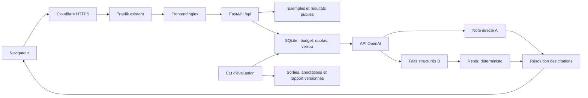

# MediNote — plan d’implémentation verrouillé

Version : 1.0 — 11 septembre 2026.

Statut : spécification d’implémentation, application non créée. Ce document est le seul fichier produit par la mission d’architecture. Aucun code applicatif, configuration de production, secret, dépôt GitHub ou enregistrement DNS n’a été modifié.

Emplacement de préparation : `/home/kenzi/IMPLEMENTATION_PLAN.md`. À l’étape 01, copier ce document dans la racine du nouveau dépôt sous le même nom. Le répertoire `/opt` n’est pas inscriptible par `kenzi` ; sa préparation est une opération administrateur explicitée à l’étape 11.

Les décisions ci-dessous sont verrouillées. Une indisponibilité de clé, de permission ou de revue humaine doit être signalée comme dépendance manquante ; elle n’autorise pas à remplacer silencieusement un modèle, un protocole, un résultat ou une architecture.

## 1. Décisions architecturales

### 1.1 Objectif et livrables

MediNote transforme une consultation fictive écrite en français en brouillon clinique structuré dont les assertions renvoient aux passages de la consultation. Le projet vise un portfolio d’ingénieur IA/NLP.

Deux pipelines sont comparés :

- **A — résumé direct** : consultation → un appel LLM → rubriques et assertions rédigées avec références aux sources.
- **B — extraction structurée** : consultation → un appel LLM → faits typés avec références → rendu Python déterministe, sans second LLM.

La comparaison porte sur les deux pipelines complets. Elle ne permet pas d’attribuer tout écart à la seule extraction puisque le mode de rédaction change aussi.

Livrables : dépôt public, application française, six exemples consultables sans appel payant, relances publiques limitées aux exemples, corpus synthétique, outils d’annotation et d’évaluation, résultats traçables, documentation française et anglaise, captures, vidéo de trois minutes et déploiement HTTPS.

Deux niveaux de livraison doivent rester distincts :

1. **Application livrable** : code, tests, exemples explicitement identifiés, protocole et déploiement fonctionnent.
2. **Étude finalisée** : vraies générations archivées et annotations humaines complètes permettent de publier les métriques sémantiques finales. L’absence de cette revue laisse l’étude en attente, sans bloquer la consultation de la démo.

### 1.2 Analyse du code et de l’environnement existants

Le dossier `/opt/medinote` est absent. La requête GitHub pour `KenziBoughadou/medinote` n’a pas trouvé de dépôt accessible. Il n’existe donc ni migration applicative ni compatibilité avec une ancienne API MediNote à assurer.

| Source examinée | Constat | Décision retenue |
| --- | --- | --- |
| `/opt/dictee-operatoire/packages/contracts/src/index.ts` | Contrats Zod pour rapports, rubriques, preuves et versions ; absence de faits typés sujet/polarité/temporalité. | Nouveaux contrats Pydantic indépendants ; aucun import depuis ce dépôt. |
| `/opt/dictee-operatoire/apps/api/src/structuring.ts` | `StructuringService.structure`, `assignServerSectionIds`, `evidenceIsGrounded`, `clinicalCoverageIsComplete` ; appel Azure, contrôles lexicaux et fallback déterministe. | Séparer appel, validation et rendu. Ne reprendre ni le fournisseur Azure, ni le fallback, ni les contrôles lexicaux comme preuve de fidélité sémantique. |
| `domain.ts`, `dates.ts`, `validation.ts`, `pdf.ts` et tests associés dans la même API | Préservation des mesures, traitement d’ambiguïtés, snapshots et empreintes d’exports. | Préserver le texte source et les versions ; conserver les empreintes ; exclure dictée, PDF et validation opératoire. |
| Fonctions pertinentes de `repository.ts`, routes rapports et `ReportEditorPage.tsx` | Provenance des modifications, source consultable, état du traitement et validation clinique. | Conserver provenance et états explicites, sans dossier patient ni validation médicale. |
| `/opt/cabinet-medical/src/components/` et layout | Composants typés, labels, focus visible, cibles de 48 px, responsive. | Reprendre les conventions d’accessibilité, sans Supabase, authentification ni données patients. |
| `/opt/cabinet-medical/docker-compose.yml`, `Dockerfile`, `nginx.conf` | Précédent de frontend nginx non privilégié sur 8080, labels Traefik et durcissement. | Frontend autonome avec routage `/api`, limites de ressources et réseau privé. |
| `/opt/docker-compose.yml`, `/opt/traefik-dynamic.yml` | Réseau externe `web`, entrées `web`/`websecure`, resolver `letsencrypt`, filtre Cloudflare global. | Ajouter seulement les labels du nouveau service ; conserver la stack globale. |
| Workflows et scripts de déploiement backend/WhatsApp | GHCR et SSH déjà employés ; incohérence possible entre tags SHA courts et longs. | SHA complet pour les tags, digests pour les releases, configuration issue du même commit que les images. |
| `/opt/ops/security-ai-context.md` | Secrets runtime centralisés sous `/opt/secrets`, services non privilégiés et observabilité existante. | Monter un secret propre à MediNote ; aucune copie de secret d’un autre projet. |

**Périmètre exact des lectures.** Lecture intégrale des README, manifests, contrats, services et tests cités en annexe A. Pour les longs fichiers de routage et de repository, lecture intégrale des fonctions pertinentes, pas de l’ensemble des fonctions patient/auth/audio. Ces sous-systèmes sont indépendants et hors scope. Aucun fichier `.env`, donnée patient, upload, base de données ou sauvegarde n’a été lu.

**État du serveur au contrôle :** 4 vCPU, 7,6 Gio de RAM, environ 4,2 Gio disponibles, aucun GPU de calcul visible, disque système occupé à 91 %, environ 6,7 Gio libres. Docker 29.8.0, Compose 5.5.1, Python 3.12.3 et Node 18.19.1. GitHub est authentifié en lecture comme `KenziBoughadou`. Le sous-domaine `medinote.kbcompany.fr` ne résout pas encore.

### 1.3 Implantation et stack

- Dépôt public cible : `https://github.com/KenziBoughadou/medinote`.
- Checkout de développement : `/home/kenzi/medinote`, inscriptible sans privilège.
- Déploiement : `/opt/medinote`, avec releases immuables dans `releases/<commit_sha>/` et liens `current` et `previous`.
- État persistant : `/var/lib/medinote/usage.sqlite3` et répertoire privé `/var/lib/medinote/experiments/` pour les campagnes exécutées sur le serveur.
- Secret runtime : `/opt/secrets/medinote.env`, monté en lecture seule dans l’API à `/run/secrets/medinote.env`.
- Frontend : React 19, TypeScript 5, Vite 7, Tailwind CSS 4 avec `@tailwindcss/vite`, `@phosphor-icons/react`, police Geist embarquée via `@fontsource/geist`.
- Runtime de build : Node 22, version minimale 22.12. Aucun remplacement du Node système du VPS.
- Préférence de travail de l’utilisateur : l’agent d’implémentation est demandé en GPT-6 Astra avec effort High. Ce réglage de l’outil de développement est distinct du modèle `gpt-4.1-mini-2025-04-14` utilisé par l’application et n’en modifie pas le budget.
- Backend : Python 3.12, FastAPI, Pydantic 2, `pydantic-settings`, SDK Python OpenAI, `httpx`, `tiktoken` et Uvicorn.
- Outils Python : `uv` et `uv.lock` ; groupes de dépendances `dev` et `eval`. Groupe `eval` : NumPy et Matplotlib. Pas de pandas requis.
- Outils frontend : npm et `package-lock.json`, ESLint, Vitest, Testing Library, Playwright et `@axe-core/playwright`.
- Versions exactes des packages résolues une fois dans les familles ci-dessus, puis verrouillées. `uv sync --frozen` et `npm ci` sont obligatoires en CI. Les mises à jour de sécurité passent par une modification explicite des lockfiles ; aucun `latest` utilisé comme image de release.
- Deux services de production : `frontend` statique nginx et `api` FastAPI avec un worker. Pas de Redis, PostgreSQL, base vectorielle ou service de tâches.

Les exigences Node sont confirmées par la [documentation Vite](https://vite.dev/guide/). Le déploiement Python suit une image construite pour l’application, conformément à la [documentation FastAPI](https://fastapi.tiangolo.com/deployment/docker/).

### 1.4 Flux des données



Le navigateur n’envoie jamais une consultation libre au serveur public. Il transmet uniquement un `case_id` autorisé et une méthode. Le serveur choisit le texte depuis son corpus. Les références attendues, annotations et tags expérimentaux ne sont jamais transmis au modèle.

### 1.5 Modèle et politique d’appel

- Identifiant : `gpt-4.1-mini-2025-04-14`, identique pour A et B.
- API : Responses, `store=false`, Structured Outputs en JSON Schema strict, sans outils, recherche web ou raisonnement demandé.
- Paramètres : `temperature=0`, `max_output_tokens=4000`, même plafond et même contenu source pour A et B ; autres paramètres laissés aux valeurs par défaut et enregistrés comme tels.
- Les schémas Pydantic sont convertis au format strict du SDK. Les propriétés nullable sont présentes avec `null`, pas omises. Tous les objets interdisent les propriétés supplémentaires.
- `max_retries=0` au niveau du SDK. Timeout total de chaque tentative : 25 secondes, imposé aussi par `asyncio.timeout`.
- Campagne scientifique : une seule tentative par case/méthode. Aucune réparation LLM ou reprise automatique. Une relance explicite crée une nouvelle campagne et ne remplace pas une observation.
- Démo publique : au plus une reprise sur 429, 502, 503 ou 504, seulement si le délai `Retry-After` est absent ou inférieur ou égal à deux secondes. La reprise réserve et comptabilise un nouvel appel. Aucun retry automatique sur timeout, refus, JSON invalide ou citation invalide.
- Deadline publique globale : 55 secondes ; timeout proxy : 65 secondes. À l’échec, l’ancien exemple reste affiché avec une erreur explicite ; il n’est jamais présenté comme une nouvelle génération réussie.
- Les troncatures, refus, erreurs de schéma et erreurs de fournisseur restent des échecs enregistrés. Aucun fallback entre A et B.

Le snapshot et Structured Outputs sont documentés dans la [fiche du modèle](https://developers.openai.com/api/docs/models/gpt-4.1-mini) et le [guide des sorties structurées](https://developers.openai.com/api/docs/guides/structured-outputs). La conformité JSON ne constitue pas une vérification de fidélité clinique.

### 1.6 Contrats de données verrouillés

Toutes les dates techniques sont ISO 8601 UTC, les montants internes sont des entiers en microdollars USD, les empreintes sont des SHA-256 hexadécimaux. JSON et JSONL sont UTF-8. `schema_version` vaut `1.0`.

**Énumérations**

| Type | Valeurs |
| --- | --- |
| `Method` | `direct`, `structured` |
| `SectionKey` dans l’ordre de rendu | `reason`, `history`, `background`, `medications_allergies`, `observations`, `assessment`, `plan` |
| Libellés correspondants | Motif ; Symptômes et histoire ; Antécédents ; Traitements et allergies ; Observations ; Évaluation exprimée ; Conduite annoncée |
| `Polarity` | `affirmed`, `negated`, `unknown` |
| `Temporality` | `present`, `past`, `future`, `unspecified` |
| `Certainty` | `reported`, `observed`, `hypothetical`, `unspecified` |
| `SubjectKind` | `patient`, `relative`, `other` |
| `Speaker` | `patient`, `clinician`, `other` |
| `OriginKind` | `illustrative`, `llm_recorded`, `llm_live` |
| `ReviewKind` | `none`, `ai`, `human` |

**Types de corpus**

- `SourceSegment` : `segment_id`, `speaker`, `text`. IDs `s001`, `s002` selon l’ordre du dialogue. Segments rédigés et versionnés dans le corpus, correspondant à des tours de parole courts ; aucune segmentation LLM à l’exécution.
- `SourceSpan` : `segment_id`, `start`, `end`, `quote`. Offsets `[start,end)` en points de code Unicode dans le texte exact du segment ; `quote == text[start:end]`. Les citations de la démo surlignent le segment entier, les spans précis servent à l’annotation.
- `Subject` : `kind`, `label: string|null`. `label=null` pour `patient`, désignation explicite pour un proche ou un tiers.
- `ConsultationCase` : `schema_version`, `case_id`, `group_id`, `family_id`, `suite: main|stress`, `split: dev|test|stress`, `title`, `locale: fr-FR`, `segments`, `provenance_id`, `focus_tags`, `stress_pair: StressPairMetadata|null`.
- `StressPairMetadata` : `pair_id`, `variant: positive|negative`, `target_fact_key`, `invariant_fact_keys`.
- `GoldFact` : `fact_id`, `case_id`, `fact_key`, `section`, `label`, `value: string|null`, `unit: string|null`, `subject`, `polarity`, `temporality`, `certainty`, `expected_in_note: boolean`, `evidence: SourceSpan[]`.
- `ProvenanceRecord` : origine de rédaction réelle, identifiant de l’auteur ou du modèle, date, empreinte du prompt si génération IA, statut des revues. Les revues humaines ultérieures sont des événements séparés associés aux hashes du corpus.

**Sorties des modèles**

- `DirectAssertion` : `text`, `source_ids: string[]`.
- `DirectOutput` : sept propriétés obligatoires portant les noms de `SectionKey`, chacune contenant une liste de `DirectAssertion`.
- `ExtractedFact` : `section`, `label`, `value`, `unit`, `subject`, `polarity`, `temporality`, `certainty`, `source_ids`.
- `ExtractionOutput` : `facts: ExtractedFact[]`.
- Les listes de références peuvent être vides : cela produit un avertissement mesurable, pas une citation inventée par le backend. Une référence inexistante est conservée comme non résolue, avec `quote=null`. Aucune suppression silencieuse d’une assertion n’est autorisée.
- Limites applicatives identiques sur les notes : 40 assertions au maximum, 1 000 caractères par assertion, huit références par assertion. Pour B, 40 faits au maximum. Un dépassement rend la sortie invalide, sans troncature logicielle.

**Sortie publique commune**

- `Citation` : `citation_id`, `segment_id`, `resolvable`, `quote: string|null`. Le backend retrouve `quote` dans le corpus ; il ne réutilise jamais une citation textuelle rédigée par le modèle.
- `NoteAssertion` : `assertion_id`, `text`, `citations: Citation[]`. IDs serveur déterministes `<section>.001`, puis ordre croissant.
- `NoteSection` : `key`, `title`, `assertions`. Une rubrique vide reste vide dans les données ; l’interface affiche « Non mentionné », sans transformer ce texte en fait généré.
- `ClinicalNote` : `case_id`, `sections`, `canonical_text`, `note_sha256`. Texte canonique : titre de rubrique, saut de ligne, une assertion par ligne, ligne vide entre rubriques. Les références restent dans leurs champs structurés ; elles ne modifient pas le hash du texte.
- `TechnicalChecks` : `schema_valid`, nombre de références émises/résolubles, IDs non résolus, assertions sans citation et avertissements. Aucun champ `clinically_valid` ou score de confiance inventé.
- `GenerationResult` : `run_id`, `case_id`, `method`, `origin`, `note`, `checks`, `metadata`, `review`, `fidelity_metrics: null|NoteEvaluation`.
- `RunMetadata` : modèle demandé/retourné, version et hash du prompt, hash du schéma et du renderer, hash du corpus, date, nombre de tentatives, tokens d’entrée/sortie connus, durée en millisecondes, coût estimé en USD ou `null` si usage inconnu.
- Pour `llm_live`, `review.kind=none` et `fidelity_metrics=null` systématiquement. Pour `illustrative`, modèle, tokens, coût et latence de génération sont `null`.

**Rendu B**

`render_extracted_fact` utilise exclusivement les champs extraits. Gabarit fixe : `{label}{value_suffix}{unit_suffix} — {polarity_label} ; {subject_label} ; {temporality_label} ; {certainty_label}.`

`value_suffix` vaut ` : <value>` si la valeur existe ; `unit_suffix` vaut ` <unit>` si l’unité existe. Libellés : polarité « affirmé », « nié », « non précisé » ; sujet « patient », « proche : <label> », « tiers : <label> » ; temps « actuel », « passé », « à venir », « temporalité non précisée » ; certitude « rapporté », « observé », « hypothèse », « certitude non précisée ». L’ordre des faits à l’intérieur d’une rubrique est celui de l’extraction. Pas de regroupement, déduction, conversion d’unité ou résolution automatique de contradiction.

Ce format rend les attributs de B inspectables. La qualité linguistique n’est pas confondue avec la fidélité et aucune supériorité stylistique n’est promise.

### 1.7 API HTTP

Préfixe unique `/api`, OpenAPI 3 produit par FastAPI. En production, `/api/openapi.json` reste public ; Swagger et ReDoc sont désactivés. Le client TypeScript est généré depuis ce contrat et versionné.

| Route | Entrée | Réponse et comportement |
| --- | --- | --- |
| `GET /api/health/live` | aucune | 200 `{status:"ok", version:<commit>}` sans accès fournisseur. |
| `GET /api/health/ready` | aucune | 200 si corpus public et SQLite lisibles, schéma DB correct ; 503 sinon. Une clé absente ne rend pas la démo enregistrée indisponible. |
| `GET /api/examples` | aucune | Six `ExampleSummary` : `case_id`, titre, angle illustré, origine des exemples disponibles. Aucun cas test. |
| `GET /api/examples/{case_id}` | ID autorisé | Consultation et deux résultats publiés, ou 404 `CASE_NOT_PUBLIC`. |
| `GET /api/capabilities` | aucune | Disponibilité live, raison éventuelle, méthodes, quotas restants pour le visiteur et instant du prochain essai ; aucun montant précis du budget global. |
| `POST /api/generate` | `{case_id:string,method:Method}` | 200 `GenerationResult`. `extra=forbid` ; ni texte, ni modèle, ni prompt, ni paramètre libre acceptés. |
| `GET /api/report` | aucune | `PublishedReport` validé, avec état de revue, cohortes, compteurs et liens vers artefacts publiés. |

`ApiError` possède `{error:{code,message,retry_after_seconds:integer|null},request_id}`. HTTP 422 pour entrée invalide ; 404 pour exemple non public ; 413 pour corps supérieur à 1 Kio ; 415 hors JSON sur la génération ; 429 pour quota, budget ou serveur occupé ; 503 pour live désactivé ou fournisseur indisponible ; 504 pour timeout ; 502 pour refus, troncature ou sortie structurée invalide. Les messages publics restent en français et n’incluent ni exception brute ni secret.

Pas de route d’export serveur : `GenerationResult` contient tout ce qui permet au navigateur de créer un fichier Markdown ou JSON localement. Pas de route publique d’annotation, de benchmark, d’administration ou d’écriture de corpus.

### 1.8 Budget, quotas et identité de requête

- Plafond conservateur : 10 USD HT estimés par mois UTC, commun à la démo et aux campagnes. L’enveloppe utilisateur reste 20 EUR par mois en plus du serveur ; le plafond en USD conserve une marge, sans promettre un taux de change.
- Tarification versionnée : 0,40 USD par million de tokens d’entrée et 1,60 USD par million de sortie. Le cache n’est pas déduit du coût estimé ; les rapports indiquent ce caractère majorant. La fiche tarifaire doit être vérifiée avant le premier appel réel ; tout changement crée une version du fichier de tarification.
- Estimation d’entrée avec `tiktoken` sur instructions, segments et schéma ; refus au-delà de 6 000 tokens estimés. Le JSON complet envoyé au fournisseur doit aussi rester inférieur ou égal à 24 000 octets UTF-8. Réservation conservatrice fixe de 25 000 microdollars, soit 0,025 USD, avant chaque tentative, couvrant le plafond d’entrée et 4 000 tokens de sortie aux tarifs figés.
- Six tentatives publiques par IP et par jour UTC ; trente tentatives publiques globales par jour UTC. Les reprises consomment ces compteurs. Un délai de 60 secondes s’applique entre deux demandes utilisateur, pas entre les deux tentatives d’une même demande.
- Une génération fournisseur simultanée pour tout le projet, API et CLI comprises. Un verrou à bail SQLite de 75 secondes encadre un travail borné à 55 secondes. Le SDK ne peut pas prolonger ce travail par ses propres retries.
- Quotas journaliers et réservations financières sont modifiés dans une transaction `BEGIN IMMEDIATE` avant l’appel. Les réservations non régularisées restent consommées. Après un crash, leur coût maximal devient `unknown`, sans remboursement automatique.
- À réception d’un usage complet, régulariser au coût estimé réel. Si une anomalie retourne un coût supérieur à la réservation, enregistrer la totalité et désactiver immédiatement les nouveaux appels ; ne pas masquer le dépassement.
- `client_key = HMAC-SHA256(QUOTA_HMAC_KEY, date_utc + ip_normalisee)`. Pas d’IP brute persistée. Effacer les clés visiteur de plus de deux jours, conserver les écritures financières douze mois.
- Le frontend nginx remplace toujours `X-MediNote-Client-IP` par `CF-Connecting-IP`. L’API n’utilise ni `X-Forwarded-For` fourni par le navigateur ni les proxy headers d’Uvicorn. L’entrée publique passe par Cloudflare puis Traefik, et l’API est sur le seul réseau privé du projet. Les processus disposant d’un accès Docker sur le serveur sont dans la frontière d’administration de confiance.
- Si l’IP Cloudflare est absente ou invalide en production, la consultation des exemples reste possible, mais l’appel payant est refusé avec `CLIENT_ADDRESS_UNAVAILABLE`. Ce quota est une protection contre les abus, pas une authentification.
- Le mode de démonstration local désactive les appels payants par défaut et ne fait pas confiance aux headers Cloudflare. Le mode test peut fournir une identité via injection de dépendance, sans route de contournement en production.

La sémantique de `CF-Connecting-IP` est décrite dans la [documentation Cloudflare](https://developers.cloudflare.com/fundamentals/reference/http-request-headers/#cf-connecting-ip).

## 2. Contraintes à respecter

1. **Données exclusivement fictives.** Aucun import de consultations réelles, audio, pièce jointe, historique patient ou donnée des projets voisins.
2. **Fidélité à la consultation.** Une information non mentionnée reste non mentionnée. Une hypothèse reste une hypothèse ; le système n’invente pas de diagnostic, prescription, dose ou résultat d’examen.
3. **Provenance exacte.** Une création ou annotation IA est marquée IA. L’agent ne peut pas créer un événement de revue humaine en se faisant passer pour l’utilisateur. Aucun score de performance n’est renseigné avant calcul sur les sorties concernées.
4. **Comparabilité.** Même consultation, même modèle et mêmes rubriques. Aucun gold fourni au générateur. Aucun correctif silencieux de A, B ou du test après observation des performances.
5. **Étanchéité du projet.** Zéro modification des dépôts `dictee-operatoire`, `cabinet-medical`, `backend`, `whatsapp-patrimonial-agent` et du Compose global.
6. **Pas de modèle local.** Pas de poids LLM, embeddings ou GPU sur ce VPS. Les builds de production s’exécutent dans GitHub Actions.
7. **Ressources bornées.** API 512 Mio, frontend 128 Mio, swap limité au même plafond ; logs 2 × 5 Mio par conteneur. Pas de `docker system prune`, `down -v`, changement global de pare-feu ou mise à jour de Node système.
8. **Secrets.** Clé OpenAI et clé HMAC centralisées ; aucun secret dans Git, frontend, Vite, build args, traces ou artefacts. Un fichier manquant n’est jamais remplacé par la clé d’un autre projet.
9. **Dépendances externes explicites.** Administrateur pour les dossiers de production ; droits GitHub/GHCR ; DNS Cloudflare ; accès SSH vérifié ; clé OpenAI ; revue humaine des données et annotations finales. Leur absence ne déclenche aucune simulation présentée comme réelle.
10. **Application accessible sans compte.** Pas d’authentification ou de session utilisateur dans cette V1. Les quotas et l’absence de saisie libre bornent le service public.
11. **Publication progressive honnête.** L’application peut afficher « évaluation humaine en attente ». Cette livraison ne doit pas être annoncée comme étude finalisée.
12. **Modification des décisions.** Tout écart d’architecture exige une nouvelle version de ce document et un motif. Une résolution de patch de dépendance à l’intérieur des familles verrouillées n’est pas un changement d’architecture.

## 3. Étapes d’implémentation

Tous les chemins de cette section sont relatifs à la racine du nouveau dépôt, sauf préfixe absolu. Les fichiers énumérés comme « à modifier » sont uniquement ceux créés par des étapes antérieures. Aucun fichier d’un autre projet ne doit être modifié.

Ordre d’exécution verrouillé : **01 → 02 → 03 → 04 → 05 → 06 → (07 et 08) → 10 → 11, première publication technique → 09, campagnes et résultats → 11, publication de la release de résultats → 12**. Les numéros désignent les lots ci-dessous ; 07 et 08 sont indépendants après 06. La première publication utilise les exemples illustratifs identifiés et le statut d’étude en attente ; elle permet aux campagnes de 09 de partager la comptabilité réelle de l’API. Le second passage par 11 réutilise le déploiement déjà implémenté. Aucun cycle de dépendance de code et aucun résultat fictif ne sont nécessaires.

### Étape 01 — Créer le dépôt et les environnements reproductibles

**Objectif exact.** Fournir une racine de projet indépendante, installable avec des dépendances verrouillées, sans fonctionnalités métier ni modification du VPS global.

**Fichiers à créer.** `IMPLEMENTATION_PLAN.md`, `.gitignore`, `.dockerignore`, `.editorconfig`, `.python-version`, `.node-version`, `pyproject.toml`, `uv.lock`, `Makefile`, `backend/src/medinote/__init__.py`, `backend/src/medinote/main.py`, `backend/src/medinote/config.py`, `backend/tests/conftest.py`, `frontend/package.json`, `frontend/package-lock.json`, `frontend/tsconfig.json`, `frontend/tsconfig.node.json`, `frontend/vite.config.ts`, `frontend/eslint.config.js`, `frontend/index.html`, `frontend/src/vite-env.d.ts`, `frontend/src/main.tsx`, `frontend/src/App.tsx`, `frontend/src/styles.css`, `frontend/src/test/setup.ts`.

**Fichiers à modifier.** Aucun.

**Fonctions/classes/composants.** `create_app(settings: Settings|None) -> FastAPI`, `Settings`, `App`.

**Changements précis.** Créer le checkout dans `/home/kenzi/medinote`, initialiser Git sur `main`, copier le plan. Configurer Python en layout `backend/src`, les extras de développement et d’évaluation, les scripts npm `dev`, `build`, `typecheck`, `lint`, `test`, `test:e2e`, `generate:api`. Fournir les cibles Make `install`, `check`, `test`, `dev`, `demo`, `contracts`, `corpus`, `benchmark`, `report`. Ignorer `.env*` sauf exemples, caches, node_modules, état SQLite, clés, expériences temporaires, mapping d’annotation aveugle et enregistrements navigateur temporaires. Ne pas ignorer les données synthétiques, résultats publiés ou lockfiles.

**Interfaces/API.** `GET /api/health/live` initial ; `Settings` lit des variables `MEDINOTE_` et, en production, `/run/secrets/medinote.env`. En développement, fichier de configuration local explicitement désigné et ignoré. Configurer `MEDINOTE_LIVE_ENABLED=false` par défaut.

**Structures de données.** `Settings` contient environnement, chemin corpus/bundle/DB, origine publique, identifiant modèle, clé OpenAI optionnelle, clé HMAC optionnelle et plafonds définis en 1.8. Une clé HMAC est requise uniquement pour activer le live en production.

Noms d’environnement exacts : `MEDINOTE_ENV=development|test|production`, `MEDINOTE_ROOT`, `MEDINOTE_STATE_DIR`, `MEDINOTE_PUBLIC_ORIGIN`, `MEDINOTE_BUILD_SHA`, `MEDINOTE_MODEL_ID`, `MEDINOTE_LIVE_ENABLED`, `MEDINOTE_OPENAI_API_KEY`, `MEDINOTE_QUOTA_HMAC_KEY`. Les deux derniers sont secrets. Le budget et les paramètres expérimentaux sont les constantes versionnées de ce plan, pas des paramètres du navigateur. En production, `MEDINOTE_ROOT=/app`, `MEDINOTE_STATE_DIR=/var/lib/medinote` et origine `https://medinote.kbcompany.fr`. La clé HMAC contient au moins 32 octets aléatoires encodés en hexadécimal. `MEDINOTE_BUILD_SHA` est injecté à la construction de l’image depuis le commit complet ; aucune clé n’est injectée au build.

**Dépendances et ordre.** Première étape. Utiliser Node 22 dans un environnement utilisateur ou conteneur de développement ; aucun `npm install` sous Node 18 pour ce projet.

**Tests à créer.** `backend/tests/test_config.py` : absence de clé compatible avec le mode enregistré, activation live sans configuration complète refusée, paramètres hors limites refusés. `frontend/src/App.test.tsx` : coque accessible et titre MediNote.

**Critères d’acceptation.** Installation avec `uv sync --frozen --group dev --group eval` et `npm ci`, import Python, typecheck TypeScript et tests de base réussis ; aucun secret suivi par Git ; aucune écriture hors checkout et fichier de plan préparé.

### Étape 02 — Définir les contrats et la résolution des sources

**Objectif exact.** Établir une seule source de vérité pour les types Python, l’API et le client TypeScript, ainsi qu’une attribution des citations vérifiable sans interprétation clinique.

**Fichiers à créer.** `backend/src/medinote/schemas.py`, `backend/src/medinote/sources.py`, `backend/src/medinote/serialization.py`, `backend/src/medinote/errors.py`, `scripts/export_openapi.py`, `contracts/openapi.json`, `frontend/src/api/schema.d.ts`, `backend/tests/test_schemas.py`, `backend/tests/test_sources.py`, `backend/tests/test_contracts.py`.

**Fichiers à modifier.** `backend/src/medinote/main.py`, `frontend/package.json`, `Makefile`.

**Fonctions/classes/composants.** Tous les types de 1.6 ; `resolve_citations(case, source_ids, assertion_id)`, `validate_source_span(case, span)`, `canonical_json(value)`, `sha256_json(value)`, `build_canonical_note(sections)`, `register_error_handlers(app)` ; script `export_openapi.main()`.

**Changements précis.** Définir les sept rubriques et leurs libellés à un seul endroit. Valider les IDs, tailles, champs supplémentaires et offsets. Conserver les références invalides dans `TechnicalChecks`. Générer les IDs des assertions et citations côté serveur. Sérialiser le JSON canonique avec clés triées, séparateurs fixes et UTF-8. Exporter OpenAPI sans lancer Uvicorn ni ouvrir une DB persistante ; générer `schema.d.ts` avec `openapi-typescript`.

**Interfaces/API.** DTO HTTP de 1.7 ; erreur commune `ApiError`. Les modèles des sorties LLM sont distincts des modèles enrichis renvoyés au navigateur.

**Structures de données.** `ConsultationCase`, `SourceSegment`, `SourceSpan`, `GoldFact`, `DirectOutput`, `ExtractionOutput`, `ClinicalNote`, `GenerationResult` et `TechnicalChecks`.

**Dépendances et ordre.** Après 01 ; Pydantic et `openapi-typescript`. Aucun appel IA.

**Tests à créer.** Référence correcte, ID absent, référence dupliquée conservée avec avertissement, liste vide, quote falsifiée, offsets négatifs/hors borne, texte avec accents et caractère Unicode non BMP, hash stable, propriété JSON supplémentaire, modèle nullable strict.

**Critères d’acceptation.** Une référence existante produit exactement le texte source ; une référence invalide ne devient pas un extrait inventé ; les types TypeScript sont régénérables sans diff ; aucun contrôle lexical n’est présenté comme validation sémantique.

### Étape 03 — Construire le corpus synthétique et son contrôle de provenance

**Objectif exact.** Créer les consultations, références et exemples nécessaires à la démo et à une comparaison sans fuite entre développement et test.

**Fichiers à créer.** `data/cases.v1.jsonl`, `data/stress.v1.jsonl`, `data/gold.v1.jsonl`, `data/provenance.v1.json`, `data/review-events.jsonl`, `data/demo_ids.v1.json`, `data/illustrative-notes.v1.json`, `data/README.md`, `data/LICENSE`, `backend/src/medinote/corpus.py`, `backend/tests/test_corpus.py`.

**Fichiers à modifier.** `Makefile`, `backend/src/medinote/config.py`.

**Fonctions/classes/composants.** `CorpusRepository.load()`, `get_case(case_id)`, `list_public_cases()`, `validate_corpus()`, `validate_splits()`, `validate_stress_pairs()`, `validate_gold_evidence()`.

**Changements précis.** Écrire 60 parents originaux : dix familles × six cas, deux dev et quatre test dans chaque famille. Familles fixées : respiratoire, cardiovasculaire, digestif, urinaire, musculosquelettique, neurologique, dermatologique, suivi chronique, santé psychique, prévention/revue thérapeutique. IDs `main-<family>-01` à `06`, avec `01` et `02` en dev. `group_id` propre à chaque parent ; une famille ne signifie pas six paraphrases. Chaque cas comprend 8 à 18 faits attendus, 8 à 24 segments et un dialogue de 150 à 700 mots. Ajouter des faits facultatifs sourcés pour distinguer ajout injustifié et information pertinente non exigée.

Écrire dix paires de stress issues de parents distincts du corpus principal : vingt cas `stress-01-positive` à `stress-10-negative`. La variante change la polarité d’un seul fait ; le diff de texte est limité au marqueur de négation et aux accords indispensables documentés. Les invariants sont listés et vérifiés dans le gold.

Les dix valeurs exactes de `family_id` sont `respiratoire`, `cardiovasculaire`, `digestif`, `urinaire`, `musculosquelettique`, `neurologique`, `dermatologique`, `suivi-chronique`, `sante-psychique`, `prevention`.

Les six exemples publics sont : `main-digestif-01` pour le cas simple, `main-respiratoire-01` pour la négation, `main-cardiovasculaire-01` pour l’antécédent familial, `main-neurologique-01` pour l’incertitude, `main-musculosquelettique-01` pour la correction et `main-prevention-01` pour le médicament. Employer exactement ces identifiants ASCII de familles dans les fichiers.

La provenance déclare les textes et références préparés par l’agent comme `ai`. Les événements de revue humaine restent absents jusqu’à une action réelle d’un relecteur identifié. Les notes illustratives fournissent douze exemples explicitement éditoriaux, sans faux modèle, coût ou score. Elles servent uniquement tant qu’aucune génération réelle correspondante n’a été publiée.

**Interfaces/API.** `CorpusRepository` ne restitue à la génération que `case_id`, langue et segments. Le endpoint public ne peut pas charger un chemin ou un cas test fourni par l’utilisateur.

**Structures de données.** Types corpus de 1.6 ; `ReviewEvent` contient `artifact_sha256`, `reviewer_id`, `kind`, `reviewed_at`, `outcome` et remarques. Un événement humain ne peut pas être produit par les scripts de génération IA.

**Dépendances et ordre.** Après 02. Pas de dataset externe, de traduction d’ACI-Bench ou d’accès aux données voisines dans cette V1.

**Tests à créer.** Effectifs 60/20/40 et vingt stress ; démos exclusivement dev ; unicité des IDs ; disjonction des parents ; preuves exactes ; dix paires complètes ; un seul fait cible inversé ; variantes et gold cohérents ; provenance obligatoire ; limite de taille de requête vérifiée ultérieurement contre les deux prompts.

**Critères d’acceptation.** Corpus structurellement valide, 80 consultations synthétiques au total, 60 parents principaux et dix parents stress, douze notes illustratives clairement marquées, aucun événement de revue humaine fictif. La relecture de fidélité éditoriale reste un jalon explicite de l’étape 09.

### Étape 04 — Implémenter les deux pipelines LLM

**Objectif exact.** Produire une note A ou B à partir d’un cas, avec un appel mesuré et une attribution des sources conservée.

**Fichiers à créer.** `backend/src/medinote/llm.py`, `backend/src/medinote/pipelines.py`, `backend/src/medinote/rendering.py`, `backend/src/medinote/prompts/common.v1.txt`, `backend/src/medinote/prompts/direct.v1.txt`, `backend/src/medinote/prompts/structured.v1.txt`, `backend/src/medinote/prompts/manifest.v1.json`, `eval/pricing.v1.json`, `backend/tests/test_llm.py`, `backend/tests/test_pipelines.py`, `backend/tests/test_rendering.py`, `backend/tests/fixtures/provider-responses.json`.

**Fichiers à modifier.** `backend/src/medinote/config.py`, `backend/src/medinote/schemas.py`, `pyproject.toml`, `uv.lock`.

**Fonctions/classes/composants.** Protocole `LLMProvider.generate(request) -> ProviderResult` ; `OpenAIProvider.generate()` ; `build_generation_request(case, method)` ; `validate_input_budget(request)` ; `DirectPipeline.run()` ; `StructuredPipeline.run()` ; `render_direct_output()` ; `render_extracted_fact()` ; `render_structured_output()`.

**Changements précis.** Prompts communs interdisant connaissance extérieure, données attendues inventées et normalisation de négation/temps/sujet. Pour A, demander une assertion atomique par item et ses segments. Pour B, demander des labels nominaux sans négation incorporée, attributs explicites et valeurs/unités conservées. Envoyer le dialogue comme document JSON délimité ; son contenu n’a aucune autorité sur les instructions système.

Inspecter `status`, `incomplete_details` et les refus avant parsing. Capturer l’usage avant la validation locale pour conserver le coût des erreurs. Préserver la sortie brute dans les campagnes ; ne jamais la corriger à l’aide du gold. Les erreurs de citations produisent des avertissements avec note conservée ; une erreur de schéma ou de borne produit un échec sans note publique partielle.

**Interfaces/API.** `ProviderResult` inclut statut, JSON brut, identifiant de réponse, modèle retourné, usage, durée et erreur normalisée. Les pipelines n’écrivent ni SQLite ni fichiers directement : l’orchestrateur de l’étape 05 finance l’appel, et le runner de l’étape 08 archive les résultats.

**Structures de données.** Sorties A/B, note commune et `ProviderResult`. Les hashes du prompt, schéma et renderer sont enregistrés dans les métadonnées.

**Dépendances et ordre.** Après 03 ; SDK OpenAI, httpx, tiktoken. Fournisseur simulé injecté dans les tests. Le modèle snapshot est obligatoire, aucun alias de remplacement.

**Tests à créer.** Une seule requête dans chaque pipeline, schéma exact envoyé, gold absent de la requête, attribution source, négation rendue depuis les attributs B, sujet proche, temps passé, hypothèse, conservation des doses/unités, références absentes, refus, troncature, JSON invalide, limite d’entrée et sortie trop longue. Tests HTTP simulés du SDK sans clé.

**Critères d’acceptation.** A et B partagent source/modèle/rubriques ; B n’effectue pas de second appel ; aucune réparation sémantique ; sorties et erreurs mesurables ; tests entièrement hors ligne.

### Étape 05 — Ajouter la comptabilité, les quotas et l’orchestration

**Objectif exact.** Garantir que tous les appels du projet sont autorisés et réservés avant exécution, avec compteurs persistants et concurrence limitée.

**Fichiers à créer.** `backend/src/medinote/usage.py`, `backend/src/medinote/generation.py`, `backend/src/medinote/client_identity.py`, `backend/src/medinote/migrations/001_usage.sql`, `backend/tests/test_usage.py`, `backend/tests/test_generation.py`, `backend/tests/test_client_identity.py`.

**Fichiers à modifier.** `backend/src/medinote/config.py`, `backend/src/medinote/main.py`, `backend/src/medinote/errors.py`.

**Fonctions/classes/composants.** `UsageStore.initialize()`, `reserve_attempt()`, `settle_attempt()`, `mark_unknown()`, `acquire_lease()`, `release_lease()`, `recover_expired_leases()`, `get_capabilities()`, `purge_visitor_keys()` ; `GenerationService.generate_public()` et `generate_experiment()` ; `normalize_client_ip()` et `derive_client_key()`.

**Changements précis.** SQLite en WAL, foreign keys actives, busy timeout de 5 secondes. Transactions courtes hors appel réseau. Un travail détient le bail global ; chaque tentative fait sa réservation atomique. La déconnexion du navigateur ne déclenche pas de nouvel appel ni remboursement : le travail borné continue jusqu’à sa régularisation. À l’arrêt brutal, la réservation reste consommée et le bail expire. Les reprises publiques suivent strictement 1.5, la CLI ne reprend pas.

**Structures SQL.** `schema_version(version)` ; `jobs(job_id,channel,case_id,method,created_at,finished_at,status)` ; `attempts(attempt_id,job_id,month_utc,day_utc,client_key,reserved_micro_usd,charged_micro_usd,status,started_at,finished_at,input_tokens,output_tokens,error_code)` ; `visitor_cooldowns(day_utc,client_key,last_request_at)` avec clé composite ; `generation_lease(singleton_id,job_id,expires_at)`. Index sur mois, jour/canal et jour/client. `channel` vaut `public` ou `experiment`. `attempts.status` vaut `reserved`, `settled` ou `unknown`.

**Interfaces/API.** `GenerationService` est l’unique point d’accès à `LLMProvider` pour la route HTTP et la CLI. Une méthode interne privée peut recevoir le fournisseur simulé dans les tests ; aucune route ne sélectionne un faux fournisseur en production.

**Dépendances et ordre.** Après 04. sqlite3, hmac et ipaddress de la bibliothèque standard. Prix versionnés. Aucun Redis.

**Tests à créer.** Deux connexions concurrentes à la même DB ; budget juste inférieur/égal à une réservation ; retries comptés ; changement de jour/mois UTC ; reprise après crash ; usage inconnu non remboursé ; expiration de bail ; transaction annulée avant appel ; quotas par IP et globaux ; absence de clé ; header forgé ignoré ; persistance après redémarrage ; restauration d’images sans restauration de budget.

**Critères d’acceptation.** Zéro appel avant réservation ; impossibilité pour deux processus de dépasser les compteurs par course ; une génération simultanée ; aucun contenu de consultation ou IP brute dans SQLite ; budget non remis à zéro par redémarrage.

### Étape 06 — Exposer l’API et préparer les artefacts publics

**Objectif exact.** Fournir les routes définitives et un bundle public immuable consommable par le serveur comme par la démo hors ligne.

**Fichiers à créer.** `backend/src/medinote/routes.py`, `backend/src/medinote/publication.py`, `backend/src/medinote/health.py`, `backend/src/medinote/http_security.py`, `scripts/build_public_bundle.py`, `public-data/bundle.v1.json`, `public-data/report.v1.json`, `backend/tests/test_api.py`, `backend/tests/test_publication.py`, `backend/tests/test_health.py`.

**Fichiers à modifier.** `backend/src/medinote/main.py`, `backend/src/medinote/schemas.py`, `contracts/openapi.json`, `frontend/src/api/schema.d.ts`, `Makefile`.

**Fonctions/classes/composants.** `list_examples()`, `get_example()`, `generate_note()`, `get_capabilities()`, `get_report()`, `check_readiness()`, `build_public_bundle()`, `validate_published_result()`, `RequestLimitsMiddleware`.

**Changements précis.** Brancher 1.7, rendre les six IDs seuls éligibles au live, rejeter corps non JSON ou trop grand, normaliser les erreurs, servir les DTO sans caches de génération. Construire le bundle avec les consultations publiques, douze résultats autorisés et hashes. Au premier passage, publier les notes `illustrative` et `report.status=awaiting_runs`, métriques nulles. L’étape 09 remplacera les notes par des résultats réels sans falsifier leur origine.

La readiness vérifie les fichiers publiés, leurs hashes, la version DB et sa disponibilité par une requête légère ; elle n’appelle pas OpenAI. Les logs applicatifs contiennent request_id, statut, méthode, durée et usage connu, mais pas body, texte du modèle ou clé.

`RequestLimitsMiddleware` compte les octets reçus par ASGI, y compris pour un corps chunked ou un faux Content-Length, et s’arrête à 1 024 octets. Sur `POST /api/generate`, accepter seulement `application/json`. Aucun CORS interorigine n’est activé. Si un header Origin est présent et diffère de l’origine publique configurée, répondre 403 `ORIGIN_NOT_ALLOWED` avant toute réservation. L’absence d’Origin n’est pas une preuve d’autorisation et reste soumise aux quotas.

**Interfaces/API.** Toutes les routes de 1.7. `PublishedReport` contient `schema_version`, `status`, `cohort_sizes`, `review_status`, `metrics`, `limitations`, `artifact_links` et hashes. Statuts : `awaiting_runs`, `awaiting_annotation`, `awaiting_reference_review`, `ai_annotated`, `human_reviewed`. `human_reviewed` exige à la fois revue humaine des références figées et annotations humaines complètes ; des notes déjà annotées sur des références non revues restent `awaiting_reference_review`.

**Structures de données.** `PublicBundle` : version, six consultations, résultats indexés par `case_id` puis `method`, date de construction, hash du contenu. Aucune référence gold ou fichier privé d’annotation dans le bundle.

**Dépendances et ordre.** Après 05. Les tests injectent corpus miniature, DB temporaire et fournisseur simulé.

**Tests à créer.** Parcours six exemples ; ID du test refusé ; champs `text`, `model` et `prompt` rejetés ; corps trop grand ; erreurs normalisées ; statistiques live toujours nulles ; notes illustratives sans fausses métadonnées ; absence de clé compatible avec GET ; liveness sans DB et readiness DB indisponible.

**Critères d’acceptation.** API conforme au contrat généré, aucun chemin public d’appel arbitraire, bundle utilisable sans réseau ni clé, aucune métrique transférée d’une sortie enregistrée vers une relance.

### Étape 07 — Construire l’interface française de comparaison

**Objectif exact.** Permettre à un recruteur d’explorer les deux méthodes, leurs sources, leur provenance et les résultats de l’étude sans assistance.

**Fichiers à créer.** `frontend/src/api/client.ts`, `frontend/src/data/provider.ts`, `frontend/src/data/api-provider.ts`, `frontend/src/data/recorded-provider.ts`, `frontend/src/state/demoReducer.ts`, `frontend/src/hooks/useDemo.ts`, `frontend/src/components/AppHeader.tsx`, `CaseSelector.tsx`, `ConsultationPane.tsx`, `ComparisonWorkspace.tsx`, `NotePane.tsx`, `CitationButton.tsx`, `RunProvenance.tsx`, `GenerationControls.tsx`, `ExportMenu.tsx`, `InlineNotice.tsx`, `frontend/src/pages/DemoPage.tsx`, `frontend/src/pages/ResultsPage.tsx`, `frontend/src/pages/MethodologyPage.tsx`, `frontend/src/lib/exportNote.ts`, `frontend/src/lib/formatters.ts`, `frontend/public/favicon.svg`, `frontend/src/state/demoReducer.test.ts`, `frontend/src/components/ComparisonWorkspace.test.tsx`, `frontend/src/lib/exportNote.test.ts`.

Les composants sans préfixe répété dans la liste précédente sont tous créés dans `frontend/src/components/`.

Créer également `scripts/sync_public_data.mjs`, `frontend/playwright.config.ts`, `frontend/e2e/demo.spec.ts`, `frontend/e2e/offline.spec.ts`, `frontend/e2e/errors.spec.ts`, `frontend/e2e/accessibility.spec.ts`, `frontend/e2e/export.spec.ts`. Ces tests existent donc avant les jobs bloquants de l’étape 11.

**Fichiers à modifier.** `frontend/src/App.tsx`, `frontend/src/main.tsx`, `frontend/src/styles.css`, `frontend/vite.config.ts`, `frontend/package.json`, `frontend/package-lock.json`, `frontend/src/App.test.tsx`.

**Fonctions/classes/composants.** Composants nommés ci-dessus ; `DataProvider.listExamples/getExample/getCapabilities/generate/getReport`, `demoReducer(state, action)`, `useDemo(provider)`, `downloadMarkdown(result, case)`, `downloadJson(result, case)`, `formatMetric(value)`, `formatCost(value)`.

**Changements précis.** Navigation locale par fragment `#demo`, `#results`, `#methodology`, sans bibliothèque de routage. `ApiDataProvider` est le mode normal ; `?mode=offline` sélectionne `RecordedDataProvider`, qui lit le bundle embarqué et désactive le live. Une panne de chargement initial de l’API permet de consulter le bundle local avec un bandeau explicite ; elle ne simule pas une génération.

`sync_public_data.mjs` copie exclusivement `public-data/bundle.v1.json` et `public-data/report.v1.json` vers `frontend/public/data/`. Ce répertoire de copie est ignoré par Git. Le script est exécuté par `predev` et `prebuild`. Le provider enregistré charge `/data/bundle.v1.json` et `/data/report.v1.json` ; aucune lecture du système de fichiers du serveur depuis le navigateur.

Le haut de page contient marque MediNote, mention « Consultation fictive · Brouillon à relire », navigation et lien GitHub. Sélecteur des six cas avec l’angle de difficulté. Au-delà de 1 280 px, trois colonnes : consultation, note A et note B. Entre 768 et 1 279 px, consultation et une note sélectionnée par onglets A/B. Sous 768 px, source puis onglets de notes sur une colonne. Largeur maximale 1 400 px, marges 24 px sur desktop et 16 px sur mobile. Pas de défilement horizontal de page.

Palette verrouillée : fond `#f7f9f8`, surfaces `#ffffff`, texte `#152522`, texte secondaire `#51645f`, bordures `#d9e3df`, accent `#227c70`. Geist auto-hébergée, corps 16 px, texte des notes 16 px avec interligne 1,6. Cibles interactives de 48 px, focus visible, contrastes AA. Pas d’animation continue, de carrousel, de gradient, d’image décorative ou de faux indicateur de précision. Transitions courtes d’opacité/transform, désactivées par `prefers-reduced-motion`.

Chaque citation est un bouton qui sélectionne et fait défiler le segment source associé. Une référence non résolue affiche « Source introuvable » sans ouvrir de lien. Le surlignage ne repose pas uniquement sur la couleur : bordure et libellé actif accompagnent l’état. Les notes sont rendues en texte React, jamais par `dangerouslySetInnerHTML`.

Chaque méthode possède son bouton « Relancer l’IA », son état de chargement et son erreur. Une seule demande locale à la fois. Le résultat chargé auparavant reste visible pendant la relance, avec statut en cours. Un changement de cas invalide les réponses devenues obsolètes grâce au couple `case_id`/`request_id`. Annuler l’attente côté navigateur n’annule pas la comptabilisation serveur. Les quotas et raisons d’indisponibilité sont affichés sans révéler les dépenses du propriétaire.

Les exports contiennent le brouillon, les sources, la méthode, l’origine et les métadonnées connues, avec la mention fictive. Le nom est `medinote-<case_id>-<method>-<run_id>.md` ou `.json`. Le Markdown échappe les caractères de balisage dans les valeurs provenant du modèle. Aucun appel serveur supplémentaire pour exporter.

La page Résultats affiche effectifs, statut réel des revues, tableaux A/B, différences et intervalles uniquement lorsqu’ils existent. Avant annotation, expliquer le protocole et montrer « Non évalué » ; ne dessiner aucune barre à zéro pour une valeur manquante. La page Méthodologie décrit A/B, jeux dev/test/stress, métriques et limites du corpus synthétique.

**Interfaces/API.** Client typé depuis `schema.d.ts`, routes 1.7. `RecordedDataProvider.generate()` retourne une erreur locale « génération indisponible hors ligne », jamais un résultat enregistré déguisé en live.

**Structures de données.** `DemoState` : cas sélectionné, données par cas/méthode, segment actif, onglet méthode, request_id actif, état réseau, état de génération, capacités. État local `useReducer`, pas de store global ou localStorage de consultations.

**Dépendances et ordre.** Après 06 ; React, Tailwind, Phosphor, Geist et APIs navigateur. Pas de bibliothèque de graphiques : tableaux HTML et petits graphiques SVG de comparaison calculés depuis les données du rapport. Graphiques exportables de l’étude produits par Python à l’étape 09.

**Tests à créer.** Citation → bon segment ; retour clavier au déclencheur ; valeur null affichée « Non évalué » ; ancienne réponse ignorée après changement de cas ; refus live en mode offline ; erreur laissant les notes enregistrées consultables ; export contenant sources et provenance ; absence d’injection HTML.

Créer les scénarios Playwright des six cas, relance réussie et en échec par interception réseau du navigateur, réponse 429, exports, mode offline, axe et viewports 390/1 024/1 440 px. Les tests backend vérifient séparément l’appel simulé via injection ASGI ; aucun fournisseur simulé activable par HTTP n’est embarqué dans l’image de production.

**Critères d’acceptation.** Parcours complet réalisable au clavier à 390, 1 024 et 1 440 px ; deux méthodes lisibles ; sources accessibles ; aucun chiffre inventé ; l’exploration et les exports fonctionnent avec l’API indisponible dès lors que les fichiers de la démo locale sont servis.

### Étape 08 — Implémenter le protocole expérimental et les outils d’annotation

**Objectif exact.** Rendre l’exécution, l’annotation et le calcul des résultats reproductibles, sans demander à un LLM de décider seul des scores finaux.

**Fichiers à créer.** `backend/src/medinote/evaluation/__init__.py`, `evaluation/schemas.py`, `evaluation/freeze.py`, `evaluation/runner.py`, `evaluation/blinding.py`, `evaluation/metrics.py`, `evaluation/report.py`, `backend/src/medinote/cli.py`, `eval/protocol.v1.json`, `eval/annotation-guide.v1.md`, `eval/amendments.jsonl`, `backend/tests/test_freeze.py`, `test_runner.py`, `test_blinding.py`, `test_alignment.py`, `test_metrics.py`, `test_bootstrap.py`, `test_reporting.py`, `backend/tests/fixtures/evaluation-cases.json`.

Les chemins `evaluation/` ci-dessus sont sous `backend/src/medinote/` ; les fichiers `test_*.py` sans préfixe répété sont sous `backend/tests/`.

**Fichiers à modifier.** `pyproject.toml`, `uv.lock`, `Makefile`, `backend/src/medinote/schemas.py` pour le DTO de rapport public.

**Fonctions/classes/composants.** `freeze_manifest()`, `verify_manifest()`, `run_batch()`, `persist_run()`, `export_blind_bundle()`, `import_annotations()`, `validate_annotation_completeness()`, `validate_alignment()`, `score_consultation()`, `aggregate_counts()`, `paired_bootstrap()`, `score_stress_pairs()`, `build_report()`, `assert_report_eligible()`, `plan_status()`, `cli.main()`.

**Changements précis.** Fournir une CLI argparse sous la commande `medinote`. Les commandes et arguments obligatoires sont :

| Commande | Contrat |
| --- | --- |
| `medinote corpus validate --root PATH` | Valider données, preuves, effectifs, taille des entrées A/B et séparation des groupes ; exit 0 ou erreurs explicites. |
| `medinote eval freeze --root PATH --output FILE` | Écrire un manifest seulement si absent ; refuser l’écrasement et enregistrer hashes et statut de revue. |
| `medinote eval run --manifest FILE --suite main-test\|stress\|demo --output DIR` | Exécuter les deux méthodes selon l’ordre figé ; répertoire de campagne neuf obligatoire. |
| `medinote eval export-blind --batch DIR --output DIR` | Produire textes, sources, références et formulaires JSONL, sans nom de méthode ou métadonnées de coût. |
| `medinote eval import-annotations --batch DIR --annotations FILE` | Valider les annotations et hashes ; importer dans un nouveau fichier, sans écraser des annotations antérieures. |
| `medinote eval report --batch DIR --annotations FILE --output DIR` | Produire métriques, graphiques, Markdown et JSON ; refuser les annotations incomplètes pour un rapport final. |
| `medinote publish --demo-batch DIR --report DIR --output DIR` | Construire le bundle public uniquement depuis les six cas dev et les résultats référencés. |
| `medinote plan-status --root PATH` | Afficher séparément état logiciel, données, appels réels, annotations IA, revue humaine et publication. |

La CLI emploie `GenerationService.generate_experiment()` et la même DB que la démo lors des appels réels sur le serveur. Une configuration pointant vers une DB temporaire n’est admise que sans clé ou en test simulé. Pas de benchmark payant dans la CI.

**Interfaces/API.** Les huit commandes du tableau constituent l’interface publique de la CLI. Elles prennent des chemins locaux, produisent les schémas ci-dessous et retournent exit 0 en succès, 2 en entrée/annotation invalide, 3 en dépendance externe absente et 4 en campagne interrompue. Aucune nouvelle route HTTP n’est créée. Le sous-ensemble JSON public du rapport est exactement le DTO `PublishedReport` de l’étape 06.

**Structures de données.**

- `FrozenManifest` : version, date, SHA du code au gel, hashes des fichiers corpus/gold/prompts/schémas/renderer/protocole/prix/lockfile, paramètres LLM, suites ordonnées et état de revue des références. Le fichier ne contient pas son propre hash. Le hash du manifest est enregistré dans chaque campagne.
- `ExperimentRun` : `batch_id`, `run_id`, `case_id`, méthode, tous les hashes, modèle demandé/retourné, paramètres, début UTC, durées, usage et coût connus, statut, erreur éventuelle, chemins relatifs de la réponse brute et de la note finale. Statuts `ok`, `api_error`, `timeout`, `refusal`, `truncated`, `schema_error`, `render_error`. Un avertissement de citation ne retire pas le statut `ok`.
- `Annotation` : `annotation_id`, `blind_output_id`, hash de note/gold/guide, annotateur `{kind:ai|human,id,model_snapshot|null,prompt_sha256|null}`, statut `draft|complete|adjudicated`, `claims`, `gold_assessments`, `segmentation_review_complete`, commentaires.
- `AnnotatedClaim` : ID sémantique, spans dans les assertions de la note, texte normalisé, label `supported_expected|supported_optional|contradiction|unsupported|unresolved`, IDs gold associés, preuves sources, types de contradiction parmi polarité/valeur/sujet/temps/certitude/autre, contrôles des citations et justification.
- `GoldAssessment` : fait attendu, statut `covered|contradicted|omitted|not_required`, claims associés et justification. Un fait attendu possède exactement un statut final.
- `CitationAssessment` : `claim_id`, `citation_id`, référence résoluble, soutien sémantique et justification. Une même citation sur une phrase multifaits peut justifier un fait sans justifier les autres.
- `MetricValue` : numérateur, dénominateur, valeur nullable ; `PairedComparison` : valeur A, valeur B, différence `B−A`, bornes IC95 nullables, effectifs et unités d’échantillonnage.

**Règles d’annotation.** Relire toutes les assertions de la note finale, quelle que soit la méthode. Une phrase contenant plusieurs faits doit être segmentée ; une répétition identique correspond à un fait sémantique avec plusieurs spans. Aligner d’abord le sujet/propriété/contexte, puis vérifier valeur, polarité, temps et certitude. Une négation inversée est une contradiction, pas simultanément une omission et un ajout. Un fait réellement soutenu mais facultatif n’est pas un ajout injustifié. Une sortie affirmant à la fois le fait et son contraire reçoit le statut gold `contradicted`. Les cas `unresolved` empêchent le rapport sémantique final.

Le guide décrit chaque label avec un exemple français, un contre-exemple et la règle de dénominateur. `validate_alignment()` contrôle les références et la cohérence des étiquettes ; il ne simule pas une décision sémantique automatique.

**Métriques verrouillées.** Pour les faits attendus : `E=C+K+O`, avec `C` correctement couverts, `K` contredits, `O` omis. Pour la note : `P` assertions sémantiques uniques, `U` non soutenues, `D` contradictoires.

| Mesure | Calcul |
| --- | --- |
| Omission | `O/E` |
| Couverture fidèle | `C/E` |
| Contradiction des faits attendus | `K/E` |
| Ajouts non soutenus | `U/P`, avec nombre d’ajouts par consultation et proportion de notes contenant au moins un ajout |
| Contradictions de sortie | `D/P` |
| Erreur de négation | Faits attendus repris avec polarité inversée / faits attendus repris dont la polarité source est explicite ; un fait est repris s’il est couvert ou contredit |
| Couverture des faits négatifs | Faits attendus négatifs correctement repris / faits attendus négatifs |
| Références résolubles | Citations émises dont l’ID existe / citations émises |
| Précision sémantique des citations | Associations claim–citation réellement justificatives / associations claim–citation émises |
| Couverture des citations | Assertions avec au moins une citation suffisante / `P` |
| Fiabilité technique | Sorties valides / tentatives prévues ; échecs par type séparés |

Les erreurs de négation sont un sous-ensemble des contradictions ; aucun score global ne les additionne. Dénominateur nul : `null`, jamais score parfait. Un échec compte dans les tentatives, donne couverture nulle et tous les faits attendus omis pour les mesures bout en bout. Sa précision d’ajouts/citations est non applicable. Présenter aussi les résultats conditionnels aux sorties valides avec leur effectif. Usage manquant : coût inconnu, pas gratuit.

Agrégats principaux micro : sommer les compteurs avant division. Bootstrap apparié de 10 000 réplications, NumPy `Generator(PCG64(20260911))`, sur les quarante IDs test triés. Même tirage pour A et B ; recalculer les ratios, puis `B−A`. IC percentile 2,5/97,5 ; conserver les indices tirés dans l’artefact. Si un ratio n’est pas défini dans au moins 95 % des tirages, son intervalle reste `null` avec avertissement. Pas de p-value ou de score de supériorité globale.

Pour le stress, une paire réussit seulement si les deux polarités cibles et les faits invariants sont correctement rendus. Dénominateur dix paires ; aucune fusion avec les quarante consultations du test principal.

**Dépendances et ordre.** Après 06 ; réutilise 03–05. NumPy pour les tirages et Matplotlib pour les exports. L’annotation se fait sur fichiers JSONL hors application publique ; pas d’outil d’annotation externe obligatoire.

**Tests à créer.** Exemple calculé à la main, assertion multifaits, répétition, facultatif soutenu, négation inversée, dose erronée, affirmation et contradiction simultanées, échec, zéro dénominateur, citation valide mais non probante, hash modifié, annotation manquante/dupliquée, provenance IA non convertible en humain, tirages A/B identiques, stress non fusionné avec le test principal.

**Critères d’acceptation.** Résultats reproductibles depuis sorties et annotations sans nouvel appel ; aucune méthode avantagée par son format intermédiaire ; tous les dénominateurs exposés ; aucune annotation partielle ou IA présentée comme revue humaine.

### Étape 09 — Geler, exécuter et publier les expériences réelles

**Objectif exact.** Produire les artefacts empiriques de MediNote avec un historique vérifiable et un état honnête de la revue.

**Fichiers à créer.** `eval/frozen-manifest.v1.json`, `eval/results/v1/run-manifest.json`, `eval/results/v1/runs.jsonl`, `eval/results/v1/raw-responses.jsonl`, `eval/results/v1/notes.jsonl`, `eval/results/v1/annotations.jsonl`, `eval/results/v1/metrics.json`, `eval/results/v1/bootstrap-indices.json.gz`, `eval/results/v1/report.md`, `eval/results/v1/figures/error-rates.svg`, `eval/results/v1/figures/coverage-cost.svg`, `eval/results/v1/figures/stress-pairs.svg`, `eval/results/v1/README.md`.

Les fichiers qui nécessitent une génération ou revue réelle ne sont créés qu’après cette action. Une dépendance manquante est inscrite dans le statut publié ; aucun fichier de résultats fictifs n’est créé pour remplir cette liste.

**Fichiers à modifier.** `data/review-events.jsonl`, `eval/amendments.jsonl`, `public-data/bundle.v1.json`, `public-data/report.v1.json`, `data/README.md`. Les prompts ne peuvent être ajustés que sur les vingt cas dev et avant création du manifest figé.

**Fonctions/classes/composants.** Commandes de l’étape 08 ; `build_report()` et `build_public_bundle()` ; aucun nouvel algorithme métier.

**Changements précis.**

1. Vérifier l’accès au snapshot et le prix officiel, puis faire un essai payé sur un cas dev via le budget partagé. Ce contrôle ne permet pas de changer de modèle sans versionner le plan.
2. Finaliser les prompts sur les vingt cas dev. Ne pas utiliser les quarante cas test pour ajuster les prompts.
3. Faire relire corpus et gold par une personne identifiée. L’agent peut préparer une pré-annotation, mais seul le relecteur crée ou confirme son événement humain. Sans cette revue, une campagne exploratoire reste permise avec mention « références préparées par IA, non relues humainement » ; elle n’atteint pas le statut final de l’étude.
4. Geler données, références, code des générateurs/rendu, paramètres, prix et protocole. Les événements de revue ajoutés ensuite se rapportent aux hashes figés ; ils ne modifient pas les textes.
5. Exécuter douze sorties de démonstration, quatre-vingts sorties principales et quarante sorties stress : 132 tentatives prévues, hors essais dev. Pour le test principal trié par case_id, alterner A→B pour les indices pairs et B→A pour les impairs ; conserver cet ordre dans le manifest.
6. Exporter les 80 notes principales et les 40 notes stress en ordre aléatoire déterministe, sans méthode affichée. Le style peut révéler B ; cette limite de l’aveuglement est déclarée. Le mapping est conservé dans le répertoire privé d’expériences, ignoré par Git jusqu’à la clôture des annotations.
7. Faire annoter l’ensemble des notes finales par l’auteur humain, y compris les assertions sans citation ; compter les échecs automatiquement. Une seconde revue externe n’est pas requise pour cette V1. Si elle n’existe pas, ne revendiquer ni indépendance de l’annotation ni validation clinique.
8. Importer les annotations, calculer les compteurs et intervalles, générer les figures SVG et le rapport. Une annotation IA peut produire un rapport exploratoire distinct `ai_annotated`, jamais écraser la campagne humaine finale.
9. Publier les douze vraies sorties dev comme `llm_recorded`. Elles sont consultables indépendamment des étapes d’annotation. Les métriques de chaque note ne sont attachées que si une annotation portant sur son hash existe ; les métriques globales du test ne sont pas recopiées sur les démos.

**Interfaces/API.** Les résultats et graphes publiés sont servis en lecture seule. `GET /api/report` passe successivement à `awaiting_annotation` puis `human_reviewed` uniquement avec preuve des opérations correspondantes.

**Structures de données.** `ExperimentRun`, `Annotation`, `FrozenManifest`, `PublishedReport`. Le rapport contient les écarts observés, les cas où B perd de l’information, l’origine du corpus, l’identité déclarée des annotateurs et les limites. Les exemples d’erreurs sont liés aux case_id/run_id réels.

**Politique de correction.** Aucun écrasement de v1. Une correction ultérieure du gold ajoute un amendement et une version v1.1, avec recalcul sur les mêmes sorties. Un changement de consultation, prompt, modèle ou renderer impose une nouvelle campagne. Une amélioration conçue après lecture du test est déclarée post hoc ; ce test ne redevient pas un test vierge.

**Dépendances et ordre.** Après 08, 10 et la première publication technique de 11, avec prompts dev stabilisés. Requiert clé OpenAI autorisée et budget disponible. Exécuter la CLI dans l’API de la release courante, racine `/app`, sorties sous `/var/lib/medinote/experiments/`. Le gel peut écrire son manifest dans ce répertoire persistant ; copier ensuite ses artefacts synthétiques vers les chemins `eval/` du checkout, sans copier la DB d’usage ou les secrets. Toute modification des prompts pendant le développement exige une nouvelle image avant le gel. La revue humaine est une dépendance réelle ; sa durée n’est pas remplacée par un appel d’agent.

**Tests à créer ou modifier.** Compléter `backend/tests/test_reporting.py` et `test_publication.py` avec artefacts synthétiques miniatures distincts des résultats scientifiques ; vérifier refus de publier un hash discordant, un résultat test comme démo ou une provenance inexacte.

**Critères d’acceptation.** Douze sorties dev réelles accessibles ; les 40 cas test et dix paires stress conservent toutes leurs tentatives ; rapport reproductible ; scores finaux uniquement après revue humaine complète. Si cette revue manque, application livrable mais étude explicitement en attente.

### Étape 10 — Conteneuriser la démo et le déploiement

**Objectif exact.** Produire deux images minimales et une configuration isolée raccordable au Traefik existant.

**Fichiers à créer.** `backend/Dockerfile`, `frontend/Dockerfile`, `frontend/nginx.conf`, `deploy/compose.production.yml`, `deploy/compose.local.yml`, `deploy/compose.ci.yml`, `deploy/runtime.env.example`, `deploy/base-images.lock.json`, `scripts/check_images.py`, `scripts/check_deployment_config.py`, `scripts/smoke.py`, `backend/tests/test_deployment_config.py`.

**Fichiers à modifier.** `.dockerignore`, `Makefile`, `frontend/vite.config.ts`, `backend/src/medinote/config.py`.

**Fonctions/classes/composants.** `check_images.main()`, `check_deployment_config.main()`, `smoke.main()` ; aucun changement de pipeline.

**Changements précis.** Build frontend sous Node 22 Alpine ; runtime nginx non privilégié. API sous Python 3.12 slim, installation des seules dépendances nécessaires au runtime et à la CLI d’évaluation. Les bases sont résolues en digests dans `base-images.lock.json` depuis les familles `node:22-alpine`, `python:3.12-slim-bookworm`, `nginxinc/nginx-unprivileged:stable-alpine` ; Dockerfiles consomment ces références immuables. Chaque release garde ses propres digests de base.

Limiter les tailles décompressées à 128 Mio pour le frontend et 600 Mio pour l’API. Conserver dans l’API sous `/app` les chemins du code, corpus, références, prompts, protocole, prix et lockfiles nécessaires au gel ; copier également les résultats publics. Le frontend embarque uniquement le bundle et le rapport publics. Le mode `make demo` démarre uniquement le frontend local avec `?mode=offline`, sans clé et sans backend. Le mode intégration local démarre les deux services, live désactivé.

**Compose production.** Projet `medinote`, services `frontend` et `api`, aucune propriété `ports`. Frontend sur réseaux `public` et `private` ; API uniquement `private`, alias `medinote-api`. `public` est externe avec `name: web`. `private` est un bridge Docker propre au projet, sans `internal:true` afin d’autoriser l’egress OpenAI. Aucun raccordement au socket Docker ou au réseau du socket proxy.

Frontend : UID/GID 101, mémoire et memswap 128 Mio, système de fichiers readonly, `cap_drop: ALL`, `no-new-privileges`, tmpfs `/tmp` 16 Mio, `/var/cache/nginx` 16 Mio et `/var/run` 1 Mio. API : UID/GID 10001, mémoire et memswap 512 Mio, mêmes restrictions, tmpfs `/tmp` 32 Mio. Les limites tmpfs sont incluses dans l’enveloppe mémoire. Journaux JSON Docker limités à `max-size=5m`, `max-file=2`, restart `unless-stopped`.

API : bind du répertoire `/var/lib/medinote` vers le même chemin, seul état inscriptible ; bind readonly de `/opt/secrets/medinote.env` vers `/run/secrets/medinote.env`, en syntaxe longue avec `bind.create_host_path=false`. Le fichier est ouvert par l’API dans le conteneur. Ne pas utiliser `env_file` côté hôte, ce qui demanderait au client Compose de lire le secret. Docker classique sur ce serveur effectue le bind via son daemon ; aucune modification des ACL globales de `/opt/secrets` n’est prévue.

Commande API : Uvicorn sur `0.0.0.0:8000`, un worker, `--no-proxy-headers`, `--no-access-log`. Healthcheck Python stdlib sur `/api/health/ready`, sans curl obligatoire. Frontend healthcheck wget sur `/healthz`. `depends_on` attend API healthy pour le mode complet.

**Labels Traefik exacts sur le frontend :**

```text
traefik.enable=true
traefik.docker.network=web
traefik.http.routers.medinote.rule=Host(`medinote.kbcompany.fr`)
traefik.http.routers.medinote.entrypoints=websecure
traefik.http.routers.medinote.tls.certresolver=letsencrypt
traefik.http.routers.medinote.service=medinote
traefik.http.services.medinote.loadbalancer.server.port=8080
```

API : `traefik.enable=false`. Le middleware global `cloudflare-only@file` reste appliqué par l’entrée HTTPS existante ; aucun remplacement de sa configuration.

**nginx.** Écoute 8080, DNS Docker `127.0.0.11` avec résolution dynamique de `medinote-api`, conservation du préfixe `/api`. Pas de cache, de buffering ou de stockage de réponse pour `/api`. `client_max_body_size 1k`, `proxy_read_timeout 65s`, `proxy_connect_timeout 5s`. Écraser `X-MediNote-Client-IP` avec `CF-Connecting-IP`, ne pas transmettre un header homonyme fourni par le visiteur. Désactiver l’access log afin de ne pas enregistrer les IP ; erreurs de proxy au niveau warn sans corps. Les erreurs de corps trop gros/type invalide sont converties vers le format `ApiError` lorsque possible ; les erreurs de gateway non JSON restent reconnues par le client comme réseau indisponible.

`/healthz` retourne 200 statique. Les fichiers `/assets/` hashés ont `Cache-Control: public,max-age=31536000,immutable` ; HTML, bundle et rapport ont `no-store`. `/api` ne possède jamais de fallback SPA. Les routes frontend ont fallback `index.html`.

Les headers de sécurité sont définis à un seul endroit, nginx : `X-Content-Type-Options: nosniff`, `X-Frame-Options: DENY`, `Referrer-Policy: no-referrer`, `Permissions-Policy: camera=(), microphone=(), geolocation=()`. CSP : `default-src 'self'; script-src 'self'; style-src 'self'; font-src 'self'; img-src 'self' data:; connect-src 'self'; object-src 'none'; base-uri 'self'; frame-ancestors 'none'; form-action 'none'`. Aucun appel externe de police ou script. La page publique de portfolio reste indexable ; ne pas copier le `noindex` des applications cliniques privées.

**Interfaces/API.** Images `ghcr.io/kenziboughadou/medinote-api` et `ghcr.io/kenziboughadou/medinote-frontend`, références par digest. Compose local publie seulement `127.0.0.1:18080` pour nginx ; l’API n’a jamais de port hôte. Compose CI utilise un projet et un réseau isolés, aucun Traefik du VPS.

**Structures de données.** `ReleaseManifest` : commit complet, deux digests d’images, tailles, architecture `linux/amd64`, hashes de la configuration, version DB supportée, hash du bundle public. Pas de valeur secrète.

**Dépendances et ordre.** Après 07 et 08. La première image contient les exemples illustratifs marqués et un rapport en attente ; les résultats de 09 seront inclus par un build ultérieur identique. Docker, Compose et nginx ; builds de production sur runner GitHub, jamais sur le VPS chargé.

**Tests à créer.** Validation statique absence de port API/public, secrets readonly, mémoire, réseaux, DNS et labels. Dans Compose CI : front/API healthy, remplacement de l’IP du conteneur API sans redémarrer nginx, CSP effective sur HTML et API, clé absente compatible avec mode enregistré, API sans accès par port hôte.

**Critères d’acceptation.** Deux images sous les plafonds de taille, services non privilégiés et healthy, exports/offline fonctionnels, appels API servis uniquement via nginx, aucun service voisin touché.

### Étape 11 — Installer la CI/CD et publier sur le serveur

**Objectif exact.** Tester chaque changement, publier des images traçables et déployer une release complète avec rollback de l’application sans recul de la comptabilité.

**Fichiers à créer.** `.github/workflows/ci.yml`, `.github/workflows/deploy.yml`, `scripts/package_release.py`, `scripts/unpack_release.py`, `scripts/deploy.sh`, `scripts/rollback.sh`, `scripts/deployment_preflight.py`, `scripts/bootstrap-admin.sh`, `docs/DEPLOYMENT.md`, `backend/tests/test_release.py`, `backend/tests/test_deploy_scripts.py`.

**Fichiers à modifier.** `Makefile`, `deploy/compose.production.yml` pour consommer les deux variables d’image obligatoires `MEDINOTE_API_IMAGE` et `MEDINOTE_FRONTEND_IMAGE` issues du manifest. Aucun fichier global du VPS.

**Fonctions/classes/composants.** `package_release()`, `safe_unpack_release()`, `validate_release()`, `deployment_preflight()` ; fonctions shell `acquire_deploy_lock`, `pull_images`, `apply_release`, `wait_ready`, `smoke_public`, `activate_release`, `rollback_release`, `prune_medinote_releases`.

**Changements précis.** Créer les workflows, scripts et contrôles décrits ci-dessous sans réutiliser les mécanismes de tags courts ou de `git pull main` des applications voisines.

**CI.** Sur pull request et push main :

1. Installer Python 3.12 et Node 22 dans les jobs.
2. Exécuter Ruff, tests Python, validation corpus et invariants de contrat ; générer OpenAPI/TypeScript et refuser le diff.
3. Exécuter ESLint, typecheck, Vitest et build frontend.
4. Construire les images localement sur le runner, vérifier taille et configuration, lancer intégration Compose sans clé, puis Playwright avec interceptions réseau réservées aux scénarios de relance. Les tests ASGI injectent séparément le fournisseur simulé.
5. Après succès uniquement, sur `main`, publier les deux images avec tag complet `sha-${{ github.sha }}` et label OCI `org.opencontainers.image.revision` égal au même SHA.
6. Récupérer les digests, créer `release.json`, `release.env` non secret et l’archive `release-<sha>.tar.gz` contenant uniquement configuration de déploiement, scripts et manifest. Publier l’artefact de release avec rétention 30 jours.

Permissions par défaut `contents:read`, `packages:write` limité au job de publication. Aucun secret d’inférence dans ces jobs. Actions GitHub tierces épinglées par commit vérifié. Les images et le dépôt deviennent publics pour permettre la reproduction sans token GHCR de lecture.

**Déploiement.** `.github/workflows/deploy.yml` est déclenché par `workflow_dispatch` avec `commit_sha` complet obligatoire. Vérifier que ce SHA appartient à `main` et possède une CI réussie du même dépôt. Télécharger son artefact exact ; aucune reconstruction, aucun `git pull main`. Environnement `production`, `concurrency` fixe `medinote-production`, `cancel-in-progress:false`.

Secrets de déploiement : `DEPLOY_HOST`, `DEPLOY_USER=kenzi`, `DEPLOY_SSH_KEY`, `DEPLOY_KNOWN_HOSTS`. Le contenu known_hosts est préparé depuis une empreinte vérifiée hors session SSH ; pas de `StrictHostKeyChecking=no` ou confiance automatique dans `ssh-keyscan` exécuté au moment du déploiement.

Transférer l’archive sous `/opt/medinote/incoming/`, l’extraire dans `releases/<sha>/` avec refus des chemins absolus, traversées `..`, liens symboliques, périphériques et fichiers non attendus. Refuser archive supérieure à 20 Mio. Les scripts valident SHA, références GHCR autorisées, digests et hashes avant invocation Docker.

Sous verrou `flock /opt/medinote/deploy.lock`, exiger le réseau `web`, fichiers de configuration cohérents, inodes disponibles supérieurs à 10 000, et espace libre au moins égal au maximum de 3 Gio et `2 Gio + 2 × somme des tailles décompressées annoncées`. Après pull, exiger encore 2 Gio libres. Si le seuil manque, arrêter avant remplacement des conteneurs ; ne pas nettoyer d’autres projets.

Après pull, inspecter les labels de révision et les digests des images. Déployer avec le Compose de la release candidate, projet `medinote`, attendre healthy puis vérifier `/healthz`, `/api/health/ready`, `/api/examples` et la page HTTPS. Ensuite seulement, déplacer atomiquement les liens `previous` et `current`. En cas d’échec après remplacement, remettre ensemble les deux images et la configuration de la release précédente, puis vérifier à nouveau. En premier déploiement sans précédente release, arrêter seulement les services MediNote et rapporter l’échec ; ne pas prétendre à un rollback réussi.

La SQLite actuelle n’est jamais restaurée par rollback : réservations et dépenses doivent rester monotones. Une migration DB non rétrocompatible est refusée en V1. Conserver la release active et la précédente. Supprimer uniquement les releases et images MediNote plus anciennes, explicitement identifiées, après succès ; jamais `system prune` ou `down -v`.

**Bootstrap administrateur, opération future unique.** `scripts/bootstrap-admin.sh` crée `/opt/medinote` et ses répertoires `incoming`/`releases` en propriétaire `kenzi:kenzi`, mode 0750 ; `/var/lib/medinote` et `experiments` en UID/GID 10001, mode 0750 ; vérifie les permissions de `/opt/secrets`, puis crée seulement `/opt/secrets/medinote.env` en propriétaire root, groupe numérique 10001, mode 0440. Refuser d’écraser un secret existant. La saisie réelle de la clé OpenAI et de la clé HMAC est effectuée par l’administrateur sans affichage ni journalisation. Le fichier peut contenir live désactivé et aucune clé pour une première publication enregistrée.

Le secret est monté par Docker et lu dans le conteneur ; pas d’ACL globale ajoutée, pas de sudoers élargi, pas d’écriture via montage privilégié détourné. Le `sudo -n` disponible dans la session ne permet pas ce bootstrap : l’administrateur doit réellement l’exécuter.

**DNS et supervision, paramètres externes à renseigner.** Créer `medinote.kbcompany.fr` dans la zone Cloudflare avec destination IP publique du VPS confirmée dans la configuration de l’hébergeur, proxy activé, TLS Full (strict). Conserver les domaines existants. Vérifier DNS, certificat et réponse HTTPS. Dans l’Uptime Kuma existant, ajouter deux contrôles HTTP, intervalle 60 secondes, trois échecs consécutifs : site `/healthz` et API `/api/health/ready`, code attendu 200. Ne pas exposer Uptime Kuma ni modifier ses protections. Les notifications restent sur la configuration opérateur existante, aucun nouveau destinataire.

**Interfaces/API.** Déploiement `scripts/deploy.sh --release-dir ABSOLUTE_RELEASE_DIR`, rollback `scripts/rollback.sh` vers le lien précédent seulement. Aucune entrée de commande arbitraire depuis HTTP. Repo public `KenziBoughadou/medinote` et packages GHCR du même propriétaire.

**Structures de données.** ReleaseManifest de 10, archive whitelistée, liens current/previous et état de déploiement JSON sans secret. Les credentials GitHub/Cloudflare/SSH ne sont jamais inclus dans le manifest.

**Dépendances et ordre.** Après 10 et CI verte. Requiert droits GitHub de création/publication, bootstrap administrateur, SSH vérifié, DNS Cloudflare et accès administrateur Uptime Kuma. En leur absence, conserver les artefacts prêts et indiquer exactement le raccordement manquant.

**Tests à créer.** Archives malveillantes rejetées, image d’un autre propriétaire refusée, SHA court rejeté, digests incohérents, disque insuffisant avant mutation, images frontend/API de commits différents, déploiements concurrents sérialisés, échec de healthcheck avec rollback des deux images, absence de previous au premier déploiement, SQLite conservée, nettoyage limité à MediNote. Tester les scripts avec commande Docker simulée pour les erreurs, puis une vraie mise à jour/rollback sur Compose CI.

**Critères d’acceptation.** Une release correspond exactement à une CI réussie et un commit ; HTTPS public accessible ; API non exposée directement ; tests de santé et de retour arrière réussis ; aucune modification des autres applications ; aucune remise à zéro des dépenses.

### Étape 12 — Finaliser le portfolio et la recette de livraison

**Objectif exact.** Fournir un projet qu’un recruteur peut comprendre, lancer, explorer et discuter, avec des preuves proportionnées au travail réellement terminé.

**Fichiers à créer.** `README.md`, `README.en.md`, `LICENSE`, `docs/ARCHITECTURE.md`, `docs/DATASET_CARD.md`, `docs/MODEL_CARD.md`, `docs/EVALUATION.md`, `docs/DEMO_SCRIPT.md`, `docs/ACCEPTANCE.md`, `docs/assets/demo-desktop.png`, `docs/assets/demo-mobile.png`, `docs/assets/demo.webm`, `scripts/record-demo.mjs`.

**Fichiers à modifier.** `frontend/package.json` pour ajouter `record:demo`, `Makefile` pour ajouter `record-demo`, `frontend/e2e/demo.spec.ts` pour vérifier les liens finaux GitHub et résultats, `IMPLEMENTATION_PLAN.md` uniquement pour renseigner le suivi d’exécution, sans modifier les décisions verrouillées. Les scénarios E2E fonctionnels existent depuis 07 et restent bloquants dans la CI de 11.

**Fonctions/classes/composants.** `recordDemo()` et scénarios Playwright ; aucun changement d’API.

**Changements précis.** README français principal et traduction anglaise avec URL publique, lien vidéo, problème traité, A/B, architecture, commandes exactes, métriques effectivement obtenues, limites et accès au protocole. MIT pour le code ; CC BY 4.0 pour corpus et annotations originales, avec provenance. Pas de revendication d’entraînement de modèle ou de validation médicale.

Le script d’entretien de cinq minutes suit : contexte, consultation de négation, comparaison des sources, architecture A/B, résultats et un cas d’échec réel, coût/latence et limites. Si les résultats humains ne sont pas prêts, remplacer la partie résultats par la démonstration de l’outil d’évaluation et son état d’attente, sans chiffres fabriqués.

Le script vidéo de trois minutes enregistre : 0–30 s choix d’un cas ; 30–80 s sources et comparaison ; 80–120 s provenance, état de relance et export ; 120–160 s rapport/méthodologie ; 160–180 s architecture et lien GitHub. Capture Playwright avec des résultats archivés authentiques, réseau fournisseur désactivé pendant l’enregistrement pour stabilité. Un exemple illustratif reste étiqueté comme tel si aucun appel réel n’a encore été possible. Vidéo WebM de moins de 25 Mio, sans secret ou donnée réelle dans l’écran.

`docs/ACCEPTANCE.md` contient date, commit testé, commandes, résultats des contrôles, état de DNS, état d’API, statut des annotations et dépendances encore ouvertes. Ne pas cocher une opération non réalisée. Les descriptions CV emploient uniquement les nombres réellement évalués.

**Interfaces/API.** Pas de nouvelle route. `make demo` et `make check` sont les points d’entrée documentés ; la démo locale fonctionne sans abonnement API.

**Structures de données.** Matrice d’acceptation et métadonnées de capture. Les captures ne constituent pas un benchmark.

**Dépendances et ordre.** Après 09 et la publication de résultats par 11 pour enregistrer l’état final. Playwright Chromium et `@axe-core/playwright` sont installés depuis 07. Configurer la capture WebM à 1 280 × 720 ; si le fichier dépasse 25 Mio, le script le réencode avec FFmpeg VP9 à 600 kbit/s, sans audio. Aucun service tiers obligatoire.

**Tests à modifier.** Dans `frontend/e2e/demo.spec.ts`, ajouter les assertions sur le lien GitHub final et l’accès au rapport publié. Réexécuter la suite créée en 07 : six cas, A/B, citations, relance simulée, erreurs, offline, exports, clavier, axe, responsive et provenance. Vérifier durée vidéo comprise entre 175 et 185 secondes, taille inférieure à 25 Mio et absence de secret à l’écran.

**Critères d’acceptation.** Dépôt public documenté, lien HTTPS vérifié, démo locale reproductible, captures et vidéo présentes, CI verte, rapport dont le statut correspond aux revues réellement faites. L’état final distingue explicitement application terminée et étude finalisée ou encore en attente.

## 4. Tests et validation

### 4.1 Commandes de référence

À exécuter depuis la racine du futur dépôt avec Node 22 et Python 3.12 :

```bash
uv sync --frozen --group dev --group eval
uv run ruff check backend scripts
uv run pytest backend/tests
uv run python scripts/export_openapi.py
npm --prefix frontend ci
npm --prefix frontend run generate:api
git diff --exit-code -- contracts/openapi.json frontend/src/api/schema.d.ts
npm --prefix frontend run lint
npm --prefix frontend run typecheck
npm --prefix frontend run test -- --run
npm --prefix frontend run build
uv run medinote corpus validate --root .
npm --prefix frontend run test:e2e
```

Les commandes payantes passent uniquement par la CLI et la comptabilité partagée dans le conteneur API. Le README fournit la commande Compose exacte basée sur la release active et son `release.env`. Aucun développeur ne doit copier le secret de production dans son checkout pour exécuter un test.

### 4.2 Matrice minimale de validation

| Domaine | Scénarios imposés | Preuve attendue |
| --- | --- | --- |
| Corpus | 60 principaux, 20 dev/40 test, dix paires stress, six démos dev, parents disjoints, sources exactes | Tests corpus + rapport de validation JSON |
| Contrats | Champs supplémentaires, nullables, IDs, Unicode, schémas stricts, client TypeScript à jour | Tests Pydantic + génération sans diff |
| Pipeline A | Une requête, source identique, rubriques correctes, pas de gold, refus/troncature | Tests fournisseur simulé et trace de requête sans secret |
| Pipeline B | Une requête, rendu déterministe, polarité/sujet/temps/certitude préservés | Tests renderer + invariants des sorties |
| Citations | Existante mais non probante, inconnue, manquante, phrase multifaits | Contrôle technique séparé de l’annotation sémantique |
| Budget | Course entre deux connexions/processus, reprise, crash, changement UTC, coût inconnu | Tests SQLite persistants temporaires |
| HTTP public | Texte libre refusé, ID test refusé, quota, timeout, provider down | Tests ASGI sans réseau externe |
| UI | Source surlignée, clavier, changements de cas, erreurs, exports, provenance | Vitest et Playwright |
| Offline | Bundle consultable, export local, génération désactivée, aucune fausse réponse live | E2E sans accès fournisseur |
| Évaluation | Comptages à la main, doublons, facultatif sourcé, contradictions, échec, null | Tests des métriques et annotations |
| Reproductibilité | Hash altéré refusé, ordre et bootstrap fixes, mapping aveugle, pas de fuite gold | Tests gel, runner et blinding |
| Publication | Live non noté, IA non étiquetée humain, résultat du test absent des démos | Tests publication/reporting |
| Docker | UID non root, réseaux isolés, ressources, secret readonly, API non publiée | Contrôle statique + intégration CI |
| Déploiement | Espace insuffisant, digest/SHA incohérent, candidat unhealthy, rollback | Tests scripts + essai CI réel |
| Production | DNS Cloudflare, TLS, santé front/API, six exemples, état live cohérent | Smoke HTTPS et entrée datée dans ACCEPTANCE |

### 4.3 Conditions de sortie

**Application terminée** lorsque le dépôt, l’interface, l’API, les outils d’évaluation, les tests, les images, la documentation, les exports et la démo locale sont livrés. **Publication terminée** lorsque GitHub/GHCR, DNS, HTTPS et supervision sont vérifiés. **Étude terminée** lorsque les références et toutes les sorties principales/stress ont été revues humainement et le rapport final est reproductible.

Les trois états sont affichés séparément. Un accès externe manquant ne justifie ni une fausse URL de livraison, ni une fausse métrique, ni un changement silencieux du plan. Aucun seuil de réduction d’erreurs n’est un critère de réussite : une absence d’amélioration de B reste un résultat scientifique valide.

## 5. Éléments explicitement hors scope

- Transcription audio, microphone, enregistrement de consultations et import de documents.
- Données réelles, dossier patient, intégration hospitalière, Supabase, identité médicale ou rapprochement patient.
- Diagnostic automatique, recommandation thérapeutique, génération de prescription et validation clinique réglementaire.
- RAG sur le Web, publications ou recommandations ; base vectorielle, embeddings et moteur de recherche documentaire.
- Fine-tuning, entraînement de modèle, hébergement GPU et benchmark multi-fournisseurs.
- Second LLM de rédaction pour B, juge LLM unique des scores finaux, correction silencieuse des sorties.
- Authentification, comptes utilisateurs, abonnement, paiement, espace personnel et saisie libre publique.
- Éditeur clinique avec sauvegarde, validation médicale, signature, export PDF et stockage de notes utilisateur.
- Streaming de tokens, file de tâches distribuée, WebSocket, haute disponibilité et déploiement sans interruption garantie.
- Service worker/PWA, application mobile native et analytique marketing.
- Réutilisation de code privé ou changement de la sécurité des projets voisins.
- Import d’ACI-Bench ou PriMock57, traduction de corpus anglais et comparaison directe à leurs scores.
- Revue par un clinicien externe obligatoire. Une telle revue pourra être ajoutée, avec sa provenance et sans modifier les résultats antérieurs.

## Annexe A — Inventaire des lectures nécessaires

### Dictée opératoire : lectures intégrales

Dans `/opt/dictee-operatoire` : `README.md`, `docs/clinical-validation.md`, `package.json`, `apps/api/package.json`, `apps/web/package.json`, `packages/contracts/package.json`, `packages/contracts/src/index.ts`, `packages/contracts/src/index.test.ts`, `apps/api/src/structuring.ts`, `apps/api/src/domain.ts`, `apps/api/src/dates.ts`, `apps/api/src/validation.ts`, `apps/api/src/pdf.ts`, `apps/api/src/jobs.ts`, `apps/api/test/structuring.test.ts`, `apps/api/test/domain.test.ts`, `apps/api/test/dates.test.ts`, `apps/api/test/manual-evidence.test.ts`, `apps/api/test/validation-atomic.test.ts`, `apps/api/test/pdf.test.ts`, `apps/web/src/lib/report.ts`, `apps/web/src/lib/report.test.ts`, `apps/web/src/pages/ReportEditorPage.tsx`.

Lectures ciblées des blocs complets pertinents : `apps/api/src/routes.ts`, routes rapports/versions/export/validation lignes 124–226 ; `apps/api/src/repository.ts`, fonctions `updateDraft`, `completeStructuredDictation`, `beginRevision`, `beginValidation`, `withManualEvidence`, lignes 465–660 et 1696–1707. Aucun autre bloc patient ou authentification requis pour ce nouveau projet.

### Cabinet médical : lectures intégrales

Dans `/opt/cabinet-medical` : `README.md`, `package.json`, `src/components/Button.tsx`, `src/components/PageHeader.tsx`, `src/components/EmptyState.tsx`, `src/components/States.tsx`, `src/components/FormField.tsx`, `src/app/RootLayout.tsx`, `src/app/ProtectedLayout.tsx`, `src/app/OfflineBanner.tsx`, `src/app/App.tsx`, `src/app/router.tsx`, `src/index.css`, `docker-compose.yml`, `Dockerfile`, `nginx.conf`, `docs/deployment.md`.

### Infrastructure : lectures intégrales pertinentes

`/opt/docker-compose.yml` avec valeurs d’environnement sensibles non restituées ; `/opt/traefik-dynamic.yml` ; `/opt/backend/.github/workflows/ci-cd.yml` et `/opt/backend/scripts/deploy.sh` ; `/opt/whatsapp-patrimonial-agent/.github/workflows/ci-cd.yml` et `/opt/whatsapp-patrimonial-agent/scripts/deploy.sh` ; `/opt/ops/images/traefik/README.md` ; `/opt/ops/images/socket-proxy/Dockerfile` ; `/opt/ops/security-ai-context.md` ; `/opt/SECURITY_WATCH_RUNBOOK.md`.

La recherche n’a trouvé aucun `AGENTS.md` applicable dans `/`, `/opt` ou les arbres des deux applications inspectées. Les répertoires privés inaccessibles n’ont pas été ouverts. Les autres applications du serveur sont hors dépendances du projet et n’ont pas fait l’objet d’une lecture exhaustive.

### Vérifications d’environnement

Permissions `/opt` et utilisateur `kenzi`, disponibilité Docker/Compose, réseau externe `web` et subnet `172.20.0.0/16`, mémoire/disque, versions Python/Node, DNS, identité GitHub en lecture, absence du nouveau dépôt accessible et de `/opt/medinote`. `sudo -n -l` réclame un mot de passe ; aucune élévation n’a été effectuée.

## Annexe B — Références techniques et méthodologiques

- [OpenAI : GPT-4.1 mini et snapshot](https://developers.openai.com/api/docs/models/gpt-4.1-mini).
- [OpenAI : Structured Outputs, refus et sorties incomplètes](https://developers.openai.com/api/docs/guides/structured-outputs).
- [OpenAI : tarifs API](https://developers.openai.com/api/docs/pricing), à vérifier avant premier appel réel et à versionner dans `eval/pricing.v1.json`.
- [Vite : exigences Node et build](https://vite.dev/guide/).
- [FastAPI : conteneurs et déploiement](https://fastapi.tiangolo.com/deployment/docker/).
- [Cloudflare : headers HTTP et CF-Connecting-IP](https://developers.cloudflare.com/fundamentals/reference/http-request-headers/#cf-connecting-ip).
- [Asgari et al., npj Digital Medicine, 2025](https://www.nature.com/articles/s41746-025-01670-7) : cadre d’analyse des omissions et hallucinations ; certaines configurations d’extraction préalable dégradent les résultats. Ce constat justifie de mesurer B sans présupposer sa supériorité.
- [Ben Abacha et al., Findings ACL, 2023](https://aclanthology.org/2023.findings-acl.161/) : évaluation de résumés cliniques et limites des métriques automatiques. Cette référence ne valide ni notre corpus synthétique ni une annotation réalisée par IA.

## Annexe C — Suivi initial

| Livrable | État au terme de la mission d’architecture |
| --- | --- |
| Analyse du code et de l’infrastructure nécessaires | Terminée, lecture seule |
| Plan détaillé verrouillé | Présent document |
| Dépôt et code MediNote | Non créés |
| Corpus et références | Non créés |
| Appels API payants | Aucun |
| Annotation humaine | Aucune |
| Images et déploiement | Non créés |
| DNS MediNote | Non configuré |
| Modifications des projets existants | Aucune |

## Annexe D — Suivi d’exécution de l’implémentation

12 septembre 2026 : code créé dans `/home/kenzi/medinote` selon les étapes 01–08 et 10–11.
Les documents et captures de 12 sont préparés. L’application contient les douze illustrations
IA identifiées et un rapport `awaiting_runs`. Les tests simulés ne sont pas des résultats
scientifiques. La publication serveur et l’étape 09 restent dépendantes du bootstrap
administrateur, des raccordements externes et d’une clé propre au projet ; la revue humaine
reste une action réelle à effectuer. Voir `docs/ACCEPTANCE.md` pour les preuves et états
actualisés, sans modification des décisions verrouillées ci-dessus.

CI du commit `fa507635bcbc5eff42bd24b074ef2712a24e68b9` réussie : 70 tests Python,
7 tests Vitest, 8 scénarios Playwright/axe, intégration Compose et rollback avec budget
conservé. Les deux images GHCR sont publiées et leurs manifests accessibles anonymement.
Archive de release vérifiée ; vidéo de 180 secondes et 17,94 Mio. DNS, bootstrap serveur,
SSH, supervision, générations réelles et revue humaine restent les dépendances ouvertes.
