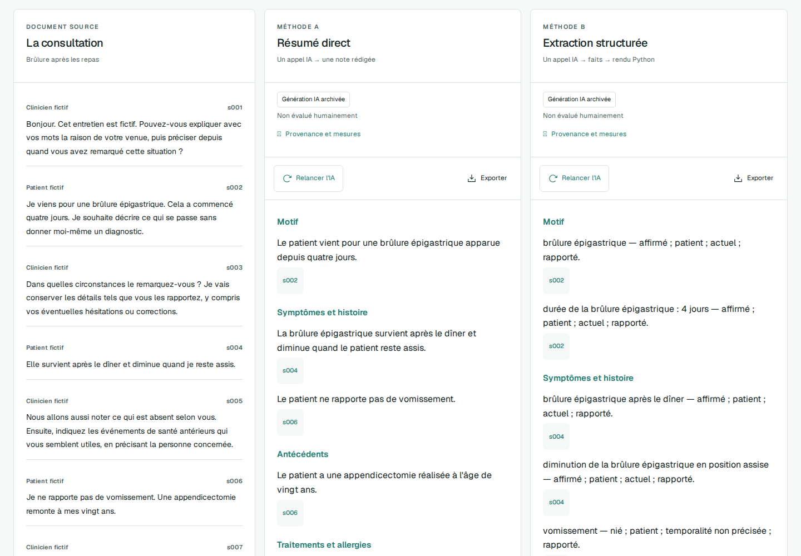
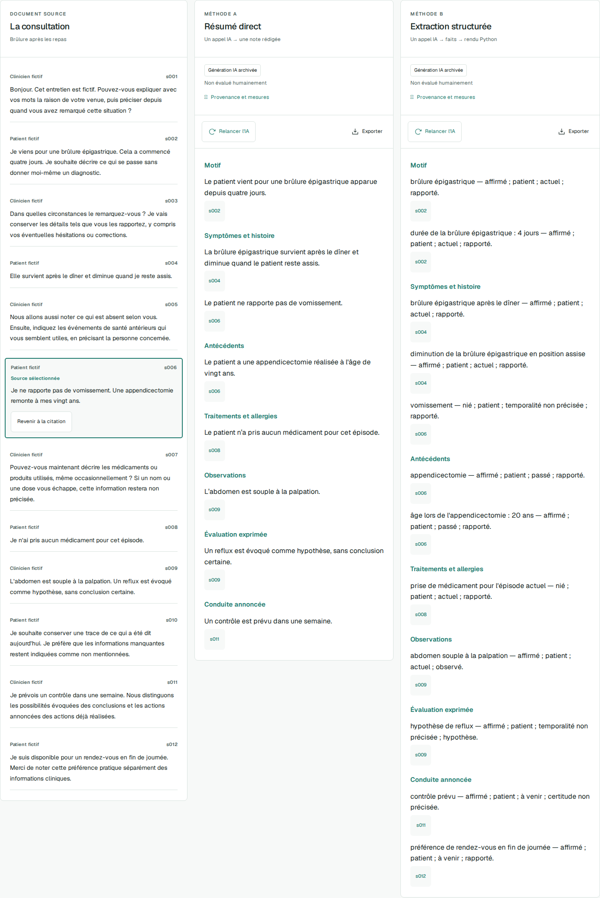

# MediNote — résumer une consultation sans en changer le sens

[](https://github.com/KenziBoughadou/medinote/actions/workflows/ci.yml)

**MediNote est un prototype de recherche qui compare deux façons de transformer un dialogue médical en une note de synthèse avec une IA.** Le lecteur peut consulter le dialogue d’origine, comparer les deux notes et retrouver les passages cités pour les vérifier.

Le projet pose une question simple : **faire extraire les informations avant de rédiger aide-t-il à mieux respecter ce qui a été dit ?** Pour y répondre, MediNote associe une application de démonstration à une expérience comparative dont les données, les réponses du modèle et le protocole sont consultables.

Toutes les consultations sont inventées. Le projet n’a pas été validé pour le soin. Il n’est pas destiné à établir un diagnostic ou à guider une décision médicale. Les notes sont des brouillons à relire.

[Essayer la démonstration](https://medinote.kbcompany.fr) · [Consulter l’expérience](eval/results/v1/README.md) · [Documentation technique en anglais](README.en.md)



*Capture de la version en ligne utilisant de vraies générations archivées. Les mentions « Non évalué humainement » indiquent l’état de la revue, pas un résultat de performance.*

## Pourquoi ce projet ?

Un résumé peut être agréable à lire tout en déformant son texte d’origine. Dans une consultation, la différence tient parfois à quelques mots : « pas de fièvre » devient « fièvre », un traitement pris par un proche est attribué au patient, ou une simple hypothèse devient un diagnostic certain.

Prenons cet exemple pédagogique : « Je tousse depuis trois jours, mais je n’ai pas de fièvre. » Une note fidèle doit conserver la toux, sa durée et l’absence de fièvre. Une note qui oublie la durée perd une information ; une note qui affirme une fièvre contredit la source. Les deux erreurs ne doivent pas être comptées de la même façon.

MediNote étudie ces écarts entre **ce qui a été dit** et **ce que l’IA en retient**. L’objectif est de rendre les erreurs repérables et mesurables, puis de comparer des méthodes sur les mêmes situations. Un gain de temps pour un professionnel serait une autre question de recherche : il n’a pas été mesuré ici.

## Deux méthodes, le même point de départ

Les deux méthodes lisent exactement le même dialogue et utilisent la même version du modèle. Chacune effectue un seul appel à l’IA.

| | A — Rédiger directement | B — Extraire, puis mettre en forme |
|---|---|---|
| Travail demandé à l’IA | Rédiger la note dans sept rubriques, avec des références au dialogue. | Dresser une liste de faits : information, personne concernée, présence ou absence, moment, degré de certitude et source. |
| Construction de la note | Le texte rédigé par l’IA est affiché. | Un programme Python transforme les faits en phrases selon des règles fixes, sans second appel à l’IA. |
| Intérêt à examiner | Une rédaction plus naturelle peut faciliter la lecture. | Des informations séparées peuvent faciliter le contrôle du sujet, des négations et de l’incertitude. |
| Risque à examiner | Une reformulation peut ajouter, omettre ou modifier une information. | L’extraction peut être erronée ou incomplète ; le programme reproduira alors cette erreur dans la note. |

Les sept rubriques couvrent le motif de consultation, les symptômes, les antécédents, les traitements et allergies, les observations, les hypothèses exprimées et les actions annoncées.

**B n’est pas supposée meilleure que A.** La comparaison porte sur les deux chaînes de traitement complètes, y compris leur manière de rédiger. Si un écart apparaît, il ne pourra pas être attribué à la seule séparation des faits.

### À quoi servent les citations ?

Chaque référence, comme `s006`, désigne un passage du dialogue. Un clic affiche ce passage pour permettre au lecteur de comparer la phrase générée à sa source.

Une citation est une aide à la vérification. Le programme peut confirmer que le passage existe ; il ne peut pas en conclure automatiquement que ce passage justifie toute la phrase. Cette seconde décision fait partie de la relecture humaine.

<details>
<summary>Voir un exemple : vérifier une négation dans le dialogue</summary>



Le passage surligné contient aussi un antécédent d’appendicectomie. Une même source peut donc justifier plusieurs faits distincts, qui doivent être examinés séparément.

</details>

## Ce qui a réellement été réalisé

La première campagne a été exécutée le **12 septembre 2026**. Ses réponses sont de vraies sorties du modèle, enregistrées avec leurs sources, leur durée, leur consommation et leur coût estimé.

| Ensemble | Rôle | Sorties archivées |
|---|---|---:|
| Six consultations de démonstration | Montrer les deux méthodes dans l’application. Elles proviennent du développement. | 12 |
| Quarante consultations de test | Comparer A et B sur des cas non utilisés pour ajuster les consignes. | 80 |
| Dix paires de stress | Observer l’effet d’une négation inversée, en conservant les autres faits. Chaque paire comporte deux variantes. | 40 |
| **Total de la campagne** | Les essais de mise au point sont comptés séparément. | **132** |

Les 132 sorties respectent les contraintes techniques et ont pu être affichées. **Cela ne signifie pas que les 132 notes sont fidèles.** La revue humaine des références et l’annotation des notes restent à effectuer. Il n’y a donc pas encore de taux d’omission, de contradiction ou de précision à annoncer.

L’application permet déjà de consulter les douze notes de démonstration, d’inspecter leurs citations et de les exporter. Aucun compte n’est nécessaire. Les relances utilisent l’IA sous quotas ; lire les notes archivées ne déclenche pas de nouvel appel. La saisie de consultations personnelles n’est pas proposée.

[Relevé d’exécution et coûts](eval/results/v1/report.md) · [Réponses et notes archivées](eval/results/v1/) · [Historique des essais et corrections](docs/DEV_TRIALS.md)

## Comment rendre la comparaison crédible ?

### Séparer la mise au point de l’évaluation

Le corpus — l’ensemble des dialogues utilisés — comprend **80 consultations fictives en français**. L’ensemble principal couvre dix familles de situations : vingt consultations servent à mettre au point les consignes données au modèle, qu’on appelle les *prompts*, et quarante autres servent au test principal. Vingt variantes supplémentaires forment les dix paires de stress.

Le contenu, les consignes, le modèle et les règles de traitement ont été figés avant les générations de test. Des empreintes numériques permettent de vérifier que ces fichiers et leurs sorties n’ont pas changé. Les erreurs rencontrées pendant le développement sont documentées ; elles n’ont pas été transformées en réussites de la campagne.

### Relire les notes, phrase par phrase

Les dialogues sont accompagnés de **800 faits de référence**, dont 720 considérés comme attendus dans les notes. Ces références ont elles aussi été préparées par IA : elles doivent être relues avant de servir de base à des conclusions finales.

L’annotation consiste ensuite à vérifier chaque information de chaque note et à consigner sa justification. Le protocole distingue notamment :

- **Une omission** : une information attendue n’a pas été reprise.
- **Une contradiction** : la note modifie une information, par exemple en inversant une négation ou en changeant la personne concernée.
- **Un ajout non soutenu** : la note affirme quelque chose que le dialogue ne permet pas d’établir.
- **Une citation insuffisante** : le passage cité existe, mais ne justifie pas l’information qui lui est attribuée.

Les 120 notes de test et de stress sont préparées pour une annotation sans nom de méthode affiché. Le style peut toutefois laisser reconnaître B : l’aveuglement reste imparfait. La version actuelle prévoit une revue par l’auteur ; une seconde lecture indépendante serait un renforcement ultérieur, pas une propriété déjà acquise.

### Comparer les résultats avec leur incertitude

Chaque consultation test possède une note A et une note B. Le protocole compare donc les méthodes sur les mêmes cas, en tenant compte des quantités d’informations à restituer. Les erreurs techniques restent comptées parmi les tentatives.

Après annotation, le calcul prévu rééchantillonne les quarante consultations 10 000 fois — une méthode appelée *bootstrap* — pour estimer l’incertitude autour des écarts observés. Les résultats des paires de négation restent présentés séparément. Aucun score unique ne viendra masquer les différences entre couverture, contradictions et ajouts.

[Protocole détaillé](docs/EVALUATION.md) · [Guide de relecture](eval/annotation-guide.v1.md) · [Description des données](docs/DATASET_CARD.md)

## Quel est le coût ?

L’IA utilisée est **GPT-4.1 mini**, dans une version identifiée précisément : `gpt-4.1-mini-2025-04-14`. MediNote l’interroge par l’API d’OpenAI, c’est-à-dire une interface accessible au programme. Il n’utilise pas l’abonnement ChatGPT du visiteur et aucun modèle n’a été entraîné spécialement pour ce projet.

L’API facture les *tokens*, des morceaux de texte lus ou générés. La campagne est estimée avec les prix versionnés suivants : **0,40 $ par million de tokens en entrée et 1,60 $ en sortie**, sans déduire les réductions liées au cache. Ces montants sont des estimations d’usage, hors taxes, et les tarifs doivent être revérifiés avant une nouvelle campagne. [Tarifs OpenAI](https://developers.openai.com/api/docs/pricing) · [Prix utilisés pour v1](eval/pricing.v1.json).

| Dépense observée dans v1 | Coût estimé |
|---|---:|
| Douze sorties de démonstration | 0,014175 $ |
| Quatre-vingts sorties du test principal | 0,094630 $ |
| Quarante sorties de stress | 0,044292 $ |
| **132 sorties au total, hors essais dev** | **0,153097 $** |

Sur les quarante cas du test principal, une note A coûte en moyenne environ **0,00079 $**, contre **0,00158 $** pour B. La durée médiane observée est de **2,29 secondes** pour A et **4,98 secondes** pour B : la moitié des appels est plus rapide, l’autre plus lente. B demande ici davantage de temps et de tokens ; il reste à déterminer si sa fidélité justifie cet écart. Ces chiffres décrivent cette campagne, pas une garantie de latence ou de prix.

À longueur de dialogues et tarifs comparables, **1 000 comparaisons A/B représenteraient environ 2,37 $ d’API**. C’est une projection arithmétique à partir du test principal, pas une mesure de charge ni la capacité actuelle du site. Des dialogues plus longs, un autre modèle ou de nouvelles tentatives changeraient ce coût.

Le coût du projet ne se limite pas aux appels IA. L’hébergement, la maintenance et surtout la relecture humaine ne sont pas inclus dans ces montants. Pour donner un ordre de grandeur de travail : **si** une note demandait 10 à 20 minutes d’annotation, les 120 notes représenteraient 20 à 40 heures, auxquelles s’ajouterait la revue des références. Cette durée est une hypothèse de planification, pas un temps mesuré.

La démonstration dispose d’un plafond applicatif de **10 $ estimés par mois**, partagé entre visiteurs et expériences. Elle limite les tentatives à six par visiteur et trente au total par jour, avec une seule génération à la fois. Les notes archivées restent consultables lorsque les relances ne sont plus disponibles.

## Limites actuelles

**Des données trop régulières pour représenter la réalité.** Les dialogues sont courts, construits selon des formulations récurrentes et préparés par IA. Ils ne reproduisent pas la diversité des échanges, les hésitations ni toutes les ambiguïtés d’une consultation réelle. Une bonne performance sur ce corpus ne suffirait pas à conclure à une aptitude clinique.

**Une référence à vérifier.** Les faits attendus peuvent eux-mêmes comporter des erreurs ou des choix discutables. La qualité de l’évaluation dépend donc de leur revue, autant que de celle des notes générées.

**Un périmètre expérimental limité.** L’étude porte sur un seul modèle, une version précise de ses consignes et une génération par méthode et par cas. Elle ne mesure pas la variabilité entre plusieurs générations d’une même note. Elle ne compare pas non plus tous les modèles disponibles.

**Un format correct ne garantit pas un contenu exact.** Les contraintes informatiques empêchent certaines combinaisons incohérentes, mais une information fausse peut respecter parfaitement le format demandé. Le cas de sujet corrigé pendant le développement illustre cette distinction ; son historique est conservé dans les [essais dev](docs/DEV_TRIALS.md).

**Un prototype textuel, sans validation de terrain.** MediNote ne transcrit pas l’audio, ne se connecte pas à un dossier patient et n’a pas été évalué dans un parcours de soin. Aucun bénéfice clinique, gain de temps réel ou validation par des professionnels n’est revendiqué.

## Comment faire progresser le projet ?

Les étapes ci-dessous sont des perspectives de recherche. Elles ne sont pas des fonctionnalités annoncées comme disponibles et ne modifient pas rétroactivement l’expérience v1.

| Priorité | Travail à réaliser | Ce qu’il permettrait d’apprendre | Effort ou coût à prévoir |
|---|---|---|---|
| **1. Terminer la revue humaine** | Relire les références, annoter les 120 notes, documenter les désaccords. | Mesurer les omissions, contradictions et ajouts sur les sorties déjà produites. | Temps de relecture ; aucun nouvel appel de génération nécessaire. |
| **2. Élargir les situations étudiées** | Construire des dialogues plus variés avec davantage de corrections, de proches mentionnés et d’incertitudes ; faire relire les références, idéalement avec un professionnel du domaine. | Vérifier si les conclusions résistent à des situations moins régulières. | Conception et annotation de nouveaux cas, puis coût d’une nouvelle campagne. |
| **3. Tester des améliorations ciblées** | Modifier une consigne ou une règle de traitement à partir des erreurs observées, puis comparer sur un nouveau jeu de test réservé. | Identifier ce qui améliore réellement la fidélité, avec quels effets indésirables. | Appels supplémentaires et relecture comparable ; conservation des anciennes versions. |
| **4. Étudier le compromis qualité, coût et délai** | Comparer d’autres modèles, répéter certaines générations et mesurer la facilité de vérification par un lecteur. | Savoir si une méthode plus lente ou plus chère apporte un bénéfice utile. | Budget fixé avant les essais ; coûts API, hébergement éventuel et temps humain. |
| **5. Envisager une adaptation du modèle** | Si des erreurs récurrentes le justifient, étudier un entraînement complémentaire sur des exemples corrigés distincts du test. | Vérifier si une spécialisation apporte davantage qu’une meilleure consigne ou de meilleurs contrôles. | Données d’apprentissage, entraînement, hébergement selon la solution et nouvelle évaluation ; aucun chiffrage fiable à ce stade. |

Le test v1 a désormais été exécuté. Une amélioration conçue après inspection de ses erreurs devra être évaluée sur de nouveaux cas pour conserver une mesure indépendante. Corriger les références demande aussi de conserver la version précédente et d’expliquer la correction.

L’effort prioritaire porte donc sur la qualité de la mesure : avant de multiplier les modèles ou les entraînements, il faut savoir quelles erreurs le système commet réellement.

## Ce que contient le travail d’ingénierie

Le modèle de langage est un composant externe. Le travail propre à MediNote porte sur la conception des deux méthodes, les données et leur protocole, la vérification des sources, l’archivage des expériences, l’interface de comparaison et l’exploitation du service.

| Composant | Rôle | Outils |
|---|---|---|
| Interface web | Lire le dialogue, comparer les notes, suivre les citations et exporter. | React, TypeScript, Vite, Tailwind CSS |
| Serveur applicatif | Préparer les requêtes, vérifier les formats, construire la note B et servir les exemples. | Python, FastAPI, Pydantic |
| Génération | Produire le résumé A ou les faits B à partir du seul dialogue. | API OpenAI, même version de GPT-4.1 mini |
| Comptabilité | Réserver le budget avant l’appel et conserver les consommations après redémarrage. | SQLite |
| Livraison et vérification | Tester les changements, construire les images et déployer une version identifiable. | GitHub Actions, Docker, nginx |

La release de résultats a passé **95 tests backend, 7 tests frontend et 8 scénarios navigateur**, dont les contrôles d’accessibilité. Ces tests vérifient le logiciel ; les performances du modèle se mesureront avec les annotations. [Preuves de vérification](docs/ACCEPTANCE.md).

[Architecture](docs/ARCHITECTURE.md) · [Modèle et paramètres](docs/MODEL_CARD.md) · [Déploiement et budget](docs/DEPLOYMENT.md) · [Plan d’implémentation](IMPLEMENTATION_PLAN.md)

## Essayer ou reproduire

Pour découvrir le projet, il suffit d’[ouvrir la démonstration](https://medinote.kbcompany.fr), de choisir un cas et de cliquer sur une référence dans l’une des notes.

Pour l’exécuter localement, installer Python 3.12, [uv](https://docs.astral.sh/uv/) et Node 22.12 ou supérieur dans la famille Node 22, puis, depuis le dépôt :

```bash
uv sync --frozen --group dev --group eval
npm --prefix frontend ci
make demo
```

Ouvrir `http://127.0.0.1:5173/?mode=offline`. Les exemples enregistrés, citations et exports fonctionnent sans clé API. Les nouvelles générations sont désactivées dans ce mode.

<details>
<summary>Commandes de vérification et démarrage du serveur local</summary>

```bash
uv run medinote corpus validate --root .
uv run medinote plan-status --root .
make check
cd frontend
npx playwright install chromium
npm run test:e2e
```

Pour démarrer l’API locale, depuis la racine du dépôt, dans un premier terminal :

```bash
uv run uvicorn medinote.main:create_app --factory --host 127.0.0.1 --port 8000 --no-proxy-headers --no-access-log
```

Dans un second terminal, depuis la même racine :

```bash
npm --prefix frontend run dev
```

Les appels réels restent désactivés par défaut. Les expériences payantes suivent les [commandes de production](docs/DEPLOYMENT.md#campagnes-réelles) pour partager le budget du service. Les secrets de production ne sont jamais copiés dans le dépôt.

</details>

Les [archives v1](eval/results/v1/README.md) permettent de vérifier les empreintes sans nouvel appel au modèle. Après annotation, les scores pourront être recalculés depuis les mêmes réponses. Cela rend l’analyse reproductible ; relancer un modèle distant ne garantit pas de retrouver exactement le même texte.

## Documents et crédits

- [Description des données et de leur provenance](docs/DATASET_CARD.md), [guide de revue des références](docs/REFERENCE_REVIEW.md) et [guide d’annotation](eval/annotation-guide.v1.md).
- [Vidéo de trois minutes](docs/assets/demo.webm) et [présentation de cinq minutes](docs/DEMO_SCRIPT.md). La vidéo montre la première version illustrative ; les captures de ce README montrent les générations réelles de la version publiée.
- Projet porté par [Kenzi Boughadou](https://github.com/KenziBoughadou), développé avec l’assistance d’outils d’IA. Le corpus et ses références ont été préparés par IA ; leur revue humaine reste explicitement en attente.
- Code sous [licence MIT](LICENSE). Corpus et annotations originales sous [CC BY 4.0](data/LICENSE).
