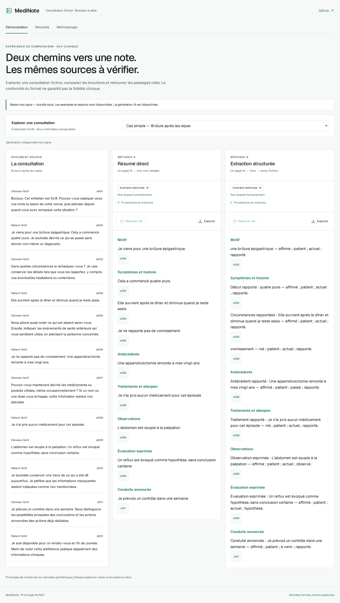

# MediNote

[](https://github.com/KenziBoughadou/medinote/actions/workflows/ci.yml)

Comparer deux pipelines IA/NLP sur des consultations françaises fictives et vérifier
les sources de chaque assertion. **Brouillons à relire, sans validation clinique.**

- **A — résumé direct** : une consultation, un appel LLM, une note structurée.
- **B — extraction structurée** : un appel LLM, des faits typés, un rendu Python déterministe.

La comparaison porte sur les pipelines complets ; leur mode de rédaction change aussi.
Aucune supériorité de B n’est présupposée.

[Plan verrouillé](IMPLEMENTATION_PLAN.md) · [English](README.en.md) ·
[Recette et état réel](docs/ACCEPTANCE.md) · [Vidéo de trois minutes](docs/assets/demo.webm)

[Ouvrir la démonstration en ligne](https://medinote.kbcompany.fr) — HTTPS et parcours navigateur
vérifiés. La démo est consultable sans compte ; les relances IA sont disponibles sous quotas.
La démo locale fonctionne aussi sans clé. Les douze notes archivées sont désormais de
**vraies générations du modèle**, avec réponses brutes, tokens, durées et coûts estimés.
Leur fidélité reste à annoter ; aucun score sémantique n’est encore publié.
Les captures et la vidéo montrent la première version illustrative, antérieure à cette campagne.



## Démarrer sans abonnement API

Prérequis : Python 3.12, [uv](https://docs.astral.sh/uv/) et Node 22.12 minimum
(version de travail dans `.node-version`). Ne pas remplacer le Node système d’un VPS partagé.

```bash
uv sync --frozen --group dev --group eval
npm --prefix frontend ci
make demo
```

Ouvrir `http://127.0.0.1:5173/?mode=offline`. Le frontend charge exclusivement son bundle
public. Les citations, changements de cas, résultats, méthodologie et exports Markdown/JSON
fonctionnent sans API. La relance est explicitement désactivée.

Pour lancer l’API locale, dans un second terminal :

```bash
uv run uvicorn medinote.main:create_app --factory --host 127.0.0.1 --port 8000 --no-proxy-headers --no-access-log
npm --prefix frontend run dev
```

Le live reste désactivé par défaut. Aucune consultation libre n’est acceptée publiquement.
Les secrets de production ne doivent jamais être copiés dans le checkout.

## Architecture

React 19, TypeScript 5, Vite 7, Tailwind 4, Geist embarquée ; FastAPI, Pydantic 2,
OpenAI Responses et SQLite. Deux services Docker : nginx non privilégié et API à un worker.
Le snapshot commun est `gpt-4.1-mini-2025-04-14`, température 0, Structured Outputs stricts,
4 000 tokens de sortie maximum, `store=false`, retries SDK désactivés.

Les citations sont résolues depuis le corpus exact. La conformité JSON et la résolution
d’un identifiant ne prouvent pas la fidélité sémantique. Aucune correction LLM ni fallback
entre méthodes n’est appliqué.

[Architecture détaillée](docs/ARCHITECTURE.md) · [Déploiement et rollback](docs/DEPLOYMENT.md)

## Corpus et évaluation

80 dialogues fictifs : 60 parents principaux dans dix familles (20 dev, 40 test), plus
10 paires de stress à négation contrôlée. Six cas dev sont publics. Chaque dialogue possède
ses références sourcées et une provenance IA explicite. **Les générations réelles sont
archivées ; la revue humaine des références et des notes reste en attente. Les métriques
de performance sont absentes, pas égales à zéro.**

[Artefacts de la campagne v1](eval/results/v1/README.md) · [Historique des essais dev](docs/DEV_TRIALS.md)

```bash
uv run medinote corpus validate --root .
uv run medinote plan-status --root .
```

Le gel enregistre les hashes du corpus, gold, prompts, schémas, renderer, prix, protocole,
code et lockfiles. Les campagnes sont archivées sans écrasement. L’annotation porte sur les
notes finales des deux méthodes, avec segmentation sémantique, alignement gold et revue des
citations. Agrégation micro, bootstrap apparié de 10 000 réplications, stress séparé.
Les appels réels utilisent uniquement la comptabilité de la release de production :
[commandes exactes](docs/DEPLOYMENT.md#campagnes-réelles).

[Dataset card](docs/DATASET_CARD.md) · [Model card](docs/MODEL_CARD.md) ·
[Évaluation](docs/EVALUATION.md) · [Guide d’annotation](eval/annotation-guide.v1.md)

## Vérifier

```bash
make check
npm --prefix frontend exec -- playwright install chromium
npm --prefix frontend run test:e2e
```

Les tests fournisseur sont simulés et distincts des résultats scientifiques. La CI construit
les images sur GitHub, vérifie l’intégration et le rollback avec comptabilité conservée,
puis publie des références GHCR par SHA complet et digest.

## Limites et coût

Corpus synthétique, préparation IA, revue humaine en attente ; aucune validation médicale,
indépendance d’annotation ou aptitude clinique revendiquée. Le rendu de B peut révéler la
méthode malgré l’export aveugle. Un résultat défavorable à B reste un résultat valide.

Budget estimé maximal de 10 USD HT par mois, partagé par API et CLI. Réservation de 0,025 USD
avant chaque tentative ; six tentatives par visiteur et trente publiques globales par jour UTC,
un travail simultané. Les usages inconnus restent réservés. Prix versionnés dans
[pricing.v1.json](eval/pricing.v1.json), sans déduction du cache.

Code sous [MIT](LICENSE). Corpus et annotations originales sous [CC BY 4.0](data/LICENSE),
avec provenance. [Présentation de cinq minutes](docs/DEMO_SCRIPT.md).
