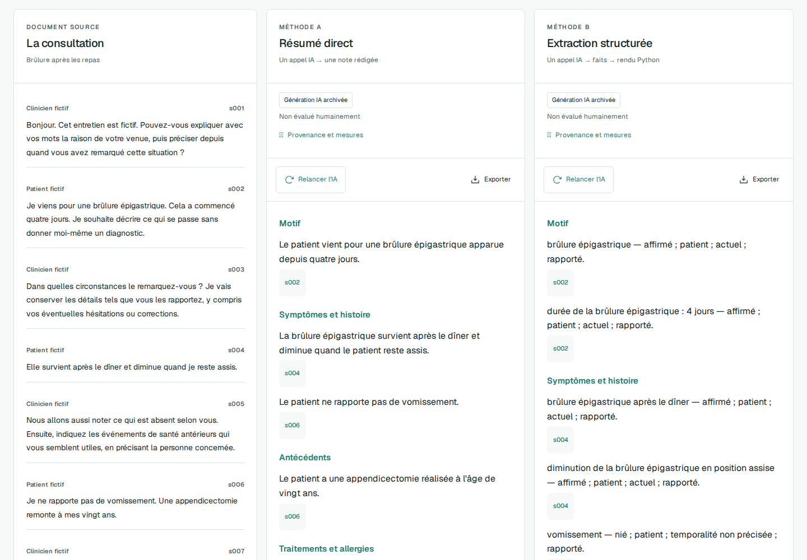

# MediNote

**Pour résumer une consultation avec un LLM, vaut-il mieux rédiger directement
ou extraire d'abord les faits ?**

Je compare deux façons de produire une note de consultation à partir d'un dialogue
fictif en français, avec le même modèle de langage. Je mesure ce que chaque note
conserve, oublie ou déforme, ainsi que son coût. Une application web permet de
comparer les deux notes et de remonter à la source de chaque phrase.

Projet académique personnel · NLP appliqué et évaluation de LLM · Python, FastAPI,
React, TypeScript · **aucun usage clinique**

[Démo en ligne](https://medinote.kbcompany.fr) · [Résultats détaillés](docs/HUMAN_REVIEW_RESULTS.md) ·
[Protocole](docs/EXPERIMENT_PROTOCOL.md) · [English](README.en.md)

## En bref

- **Extraire d'abord les faits ne rend pas la note plus fidèle, sur ce corpus.**
  La rédaction directe (A) conserve 95,8 % des faits attendus, contre 92,5 % pour
  l'extraction structurée (B). L'écart de −3,3 points est net : son intervalle de
  confiance à 95 % va de −5,3 à −1,4 points.
- **B coûte deux fois plus cher et met deux fois plus de temps** : 2,3 s contre
  5,0 s de latence médiane par note.
- **Aucune information sans source** n'a été relevée dans les 80 notes de test
  relues. Les erreurs sont surtout des oublis : 15 faits omis pour A, 26 pour B,
  sur 360 chacun.

*La démo affiche le dialogue, puis les deux notes. Chaque phrase renvoie au passage
du dialogue qui la soutient.*

## Ce que j'en retiens

- **Structurer ne garantit pas la fidélité.** B produit plus d'éléments que A
  (432 contre 364) mais perd davantage de faits attendus. En découpant le dialogue
  en faits isolés, l'extraction laisse tomber des précisions : une action de suivi
  annoncée, une observation sans chiffre.
- **Les deux méthodes ne perdent pas les mêmes choses.** Dans le test de négation,
  B conserve la préférence horaire du patient dans 20 notes sur 20, A dans 2 sur 20.
  La structure semble aider à garder les détails ponctuels, que la rédaction
  directe a tendance à résumer.
- **Un format rigoureux peut rendre une erreur très visible.** B a produit
  « absence de traitement médical — nié » : le format est valide, la citation mène
  au bon passage, mais le sens est inversé.
- **Une citation correcte ne prouve pas que la phrase soit juste.** Il faut lire
  le passage cité, ce que la démo facilite sans le remplacer.

## Résultats

40 consultations de test, une note par méthode et par consultation. Je les ai
relues une à une, présentées sous des identifiants neutres qui masquaient la méthode.

| Mesure | A, direct | B, structuré | Écart B−A [IC 95 %] |
|---|---:|---:|---|
| Faits attendus correctement repris | 95,83 % | 92,50 % | −3,33 points [−5,28 ; −1,39] |
| Faits attendus omis | 4,17 % | 7,22 % | +3,06 points [+1,11 ; +5,00] |
| Informations contradictoires dans la note | 0,00 % | 0,23 % | +0,23 point [0,00 ; +0,71] |
| Informations sans source dans la note | 0,00 % | 0,00 % | 0,00 point |
| Coût moyen par note | 0,00079 $ | 0,00158 $ | ×2,00 [1,95 ; 2,05] |
| Latence médiane | 2,29 s | 4,98 s | ×2,17 [1,94 ; 2,29] |

Les intervalles viennent d'un bootstrap apparié sur les 40 consultations
(10 000 tirages). L'ensemble des 132 appels au modèle a coûté environ 0,15 $.

**Test de négation.** Dix paires de dialogues ne diffèrent que par une négation
(« je rapporte une fièvre » / « je ne rapporte pas une fièvre »). Les deux méthodes conservent bien le fait inversé
(10 paires sur 10 pour A, 9 sur 10 pour B). Mais aucune ne réussit le critère strict,
qui exige aussi tous les autres faits : les 40 notes omettent que l'origine de la
plainte reste à préciser. Ce critère, trop agrégé, ne départage donc pas les méthodes ;
le [diagnostic détaillé](eval/results/stress-diagnostic-v1/) sépare chaque dimension.

L'[analyse de neuf erreurs](docs/ERROR_ANALYSIS.md) montre des cas concrets,
avec le dialogue, la note et l'annotation.

## Méthode

- **A, rédaction directe** : le modèle reçoit le dialogue et rédige une note en
  sept rubriques, avec une référence au passage source pour chaque phrase.
- **B, extraction puis mise en forme** : le modèle extrait des faits typés
  (sujet, négation, temporalité, certitude), puis un programme Python les met
  en forme selon des règles fixes, sans second appel au modèle.
- **Modèle** : `gpt-4.1-mini` via l'API OpenAI, sorties JSON contraintes par un
  schéma, une génération par méthode et par cas.
- **Données** : 80 consultations fictives en français (20 de développement,
  40 de test, 10 paires de négation), soit 800 faits de référence avec leur
  passage source.
- **Évaluation** : pour chaque note, je classe chaque information comme correcte,
  contradictoire ou sans source, puis je relève les faits attendus oubliés.

Le code, les données, les consignes et le modèle ont été
[gelés](https://github.com/KenziBoughadou/medinote/commit/3138ec963c32c6c5acfac93ffddbf0490f5c08ca)
avant la campagne de test. Comme le mode de rédaction change aussi entre A et B,
l'écart observé ne s'attribue pas à la seule étape d'extraction.

[Règles d'évaluation](docs/EVALUATION.md) · [Guide d'annotation](eval/annotation-guide.v1.md) ·
[Comparateurs extractifs sans LLM](eval/results/extractive-posthoc-1/report.md)

## Démo

[medinote.kbcompany.fr](https://medinote.kbcompany.fr) présente six consultations
fictives et les douze notes réellement générées pour elles. On peut comparer les
notes, ouvrir le passage cité par chaque phrase, exporter un brouillon et relancer
une génération dans la limite d'un quota. Aucune donnée personnelle ne peut être saisie.
[Lancer la démo en local](docs/DEMO.md#lancer-la-démo-en-local)

## Architecture

Une interface React et TypeScript affiche les dialogues et les notes. Un backend
Python (FastAPI, Pydantic) prépare les requêtes, valide les sorties du modèle et
construit la note B. SQLite gère le budget et les quotas. Docker et GitHub Actions
testent et publient chaque version.

[Architecture détaillée](docs/ARCHITECTURE.md) · [Fiche du système](docs/MODEL_CARD.md) ·
[Fiche des données](docs/DATASET_CARD.md)

## Limites

- **Corpus synthétique et très régulier.** Les dialogues et les références ont été
  générés par un LLM, avec 12 tours et 9 faits attendus chacun. Les deux méthodes
  approchent donc du plafond, et le corpus ne reflète pas de vraies consultations.
- **Un seul relecteur, moi-même**, sans second avis. Le style de B pouvait révéler
  la méthode malgré les identifiants neutres.
- **Une règle d'annotation modifiée après avoir vu les sorties**, pour accepter
  cinq informations correctes absentes des références. Le changement est
  [documenté](docs/ANNOTATION_AMENDMENT_V1_1.md) et ne modifie ni les dialogues
  ni les générations.
- **Un seul modèle et une seule génération par cas** : les intervalles mesurent
  la variation entre consultations, pas entre générations.
- **Aucune validation clinique**, et aucun gain de temps mesuré en situation réelle.

## Pistes pour une v2

- Évaluer sur des dialogues plus réalistes, par exemple des corpus publics de
  consultations annotées (ACI-Bench, MTS-Dialog).
- Faire relire une partie des notes par une seconde personne du domaine et mesurer
  l'accord entre relecteurs.
- Comparer avec un modèle open-weight exécuté localement, plus compatible avec
  l'hébergement de données de santé.
- Pondérer les erreurs par leur gravité clinique : oublier une allergie ne pèse pas
  autant qu'oublier une préférence horaire.

La [release v1](https://github.com/KenziBoughadou/medinote/releases/tag/v1)
rassemble le code, les résultats et l'analyse. Code sous licence [MIT](LICENSE) ;
corpus et annotations sous [CC BY 4.0](data/LICENSE).
