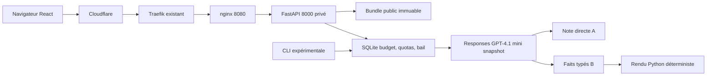

# Architecture implémentée

Le [plan verrouillé](../IMPLEMENTATION_PLAN.md) reste la source de vérité.

Le frontend est une application à navigation par fragments, avec état local `useReducer`.
Les types proviennent de Pydantic via OpenAPI et `openapi-typescript`. Il n’existe ni
saisie clinique libre, compte, dossier patient, stockage navigateur de consultation,
route publique d’administration ou d’annotation.

La couche fournisseur capture usage, statut et sortie brute avant validation. Les pipelines
ne persistent rien. `GenerationService` réserve chaque tentative via `UsageStore`, applique
le bail global et régularise le coût, même si la sortie est invalide. La réponse live ne
reçoit aucune métrique d’une ancienne note. B applique les gabarits littéraux du plan.

SQLite utilise WAL et BEGIN IMMEDIATE. Les appels réseau restent hors transaction.
Un crash ne rembourse pas la réservation ; le bail expire après 75 secondes. Les quotas
et le budget persistent lors d’un redémarrage ou rollback d’image. Les clés visiteur sont
HMAC-SHA256 avec rotation journalière, sans IP brute en base. Les anciennes clés sont purgées.

nginx remplace le header d’identité avec CF-Connecting-IP, sans faire confiance au header
homonyme du navigateur. L’API est uniquement sur le réseau privé et Uvicorn ignore les
proxy headers. L’absence d’IP Cloudflare en production interdit uniquement les appels payants.
Les sources ne sont jamais journalisées. Les headers CSP et de sécurité sont centralisés dans nginx.

Les sorties publiques illustratives sont des artefacts éditoriaux IA. Les générations
scientifiques et leurs annotations ne seront créées qu’après exécution effective. Les
contrôles techniques n’interprètent jamais la fidélité clinique.
